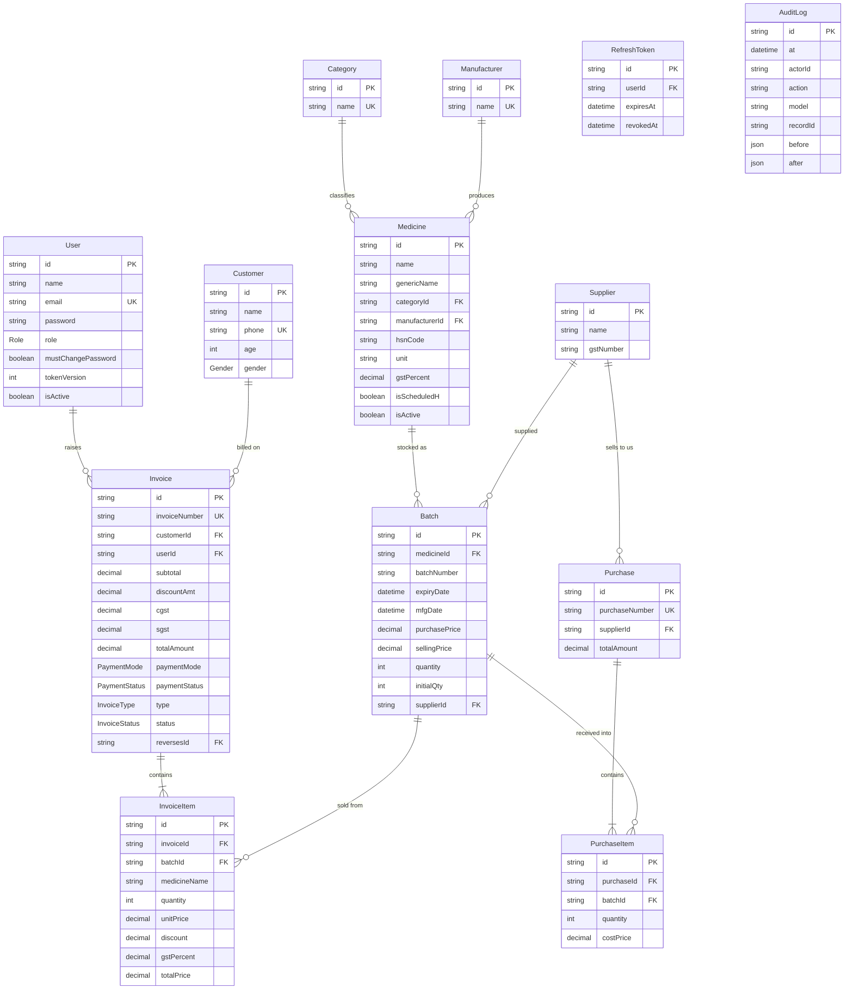

# Data Model

Source of truth: [`backend/prisma/schema.prisma`](../backend/prisma/schema.prisma) · PostgreSQL 15 · Prisma 5.10

All primary keys are **CUID strings** (`@default(cuid())`), not integers — IDs are opaque and safe to expose.

---

## 1. Entity-relationship diagram



`AuditLog` stands apart on purpose: it has **no relation to `User`**, so attribution survives the actor being deleted. `RefreshToken` cascades with its user.

**Reading the cardinalities:** an `Invoice` must have at least one `InvoiceItem` in practice (the validator requires it) though the database does not enforce it. `Invoice.customerId` is nullable — walk-in sales carry no customer. Everything else marked FK is mandatory.

---

## 2. Enumerations

| Enum              | Values                                  | Default        | Used by                   |
| ----------------- | --------------------------------------- | -------------- | ------------------------- |
| `Role`          | `ADMIN`, `PHARMACIST`, `CASHIER`  | `CASHIER`    | `User.role`             |
| `Gender`        | `MALE`, `FEMALE`, `OTHER`         | *(nullable)* | `Customer.gender`       |
| `PaymentMode`   | `CASH`, `UPI`, `CARD`, `CREDIT` | `CASH`       | `Invoice.paymentMode`   |
| `PaymentStatus` | `PAID`, `PENDING`, `PARTIAL`      | `PAID`       | `Invoice.paymentStatus` |
| `InvoiceType`   | `SALE`, `CREDIT_NOTE`               | `SALE`       | `Invoice.type`          |
| `InvoiceStatus` | `ACTIVE`, `CANCELLED`               | `ACTIVE`     | `Invoice.status`        |

`InvoiceType` and `InvoiceStatus` are kept apart from `PaymentStatus` on purpose — see §3.8 and §8.

---

## 3. Table reference

### 3.1 `User`

| Column                        | Type     | Constraints                | Notes                                                                      |
| ----------------------------- | -------- | -------------------------- | -------------------------------------------------------------------------- |
| `id`                        | String   | PK, cuid                   |                                                                            |
| `name`                      | String   | required                   |                                                                            |
| `email`                     | String   | **unique**, required | Login identity; duplicates surface as`409`                               |
| `password`                  | String   | required                   | bcrypt hash, cost 12. Never selected into responses                        |
| `role`                      | Role     | default`CASHIER`         |                                                                            |
| `mustChangePassword`        | Boolean  | default`false`           | Set on the seeded bootstrap admin. While true the API answers`403 PASSWORD_CHANGE_REQUIRED` to every route except reading your own profile and changing your password — the credential is published in this repository, so the account is created unusable rather than merely discouraged (threat T-2) |
| `tokenVersion`              | Int      | default`0`               | Revocation counter (FR-AUTH-09). Every issued token carries the value current when it was signed;`protect` rejects any token whose copy has fallen behind. `POST /api/auth/logout` increments it, ending every session for that account. A counter rather than a timestamp because JWT `iat` is second-granular — a token signed in the same second as a logout would survive it |
| `isActive`                  | Boolean  | default`true`            | `false` blocks login *and* invalidates existing tokens on next request |
| `createdAt` / `updatedAt` | DateTime | auto                       |                                                                            |

Relations: `invoices Invoice[]`.

> Every user query in the codebase uses an explicit `select` that omits `password` — except the two places that need the hash to compare it (`login`, `changePassword`). Preserve that discipline when adding queries.

### 3.2 `Category`

| Column   | Type   | Constraints                         |
| -------- | ------ | ----------------------------------- |
| `id`   | String | PK, cuid                            |
| `name` | String | **unique**, min 2 chars (Zod) |

Relations: `medicines Medicine[]`. Hard delete — fails with an FK error if any medicine references it.

### 3.3 `Manufacturer`

Identical shape to `Category`: `id`, unique `name`, `medicines Medicine[]`. Hard delete.

### 3.4 `Medicine`

| Column                        | Type         | Constraints        | Notes                                                                                                                          |
| ----------------------------- | ------------ | ------------------ | ------------------------------------------------------------------------------------------------------------------------------ |
| `id`                        | String       | PK, cuid           |                                                                                                                                |
| `name`                      | String       | required, min 2    | Brand name                                                                                                                     |
| `genericName`               | String?      | optional           | Salt / molecule; searchable                                                                                                    |
| `categoryId`                | String       | FK → Category     |                                                                                                                                |
| `manufacturerId`            | String       | FK → Manufacturer |                                                                                                                                |
| `hsnCode`                   | String?      | optional           | HSN for GST classification; searchable                                                                                         |
| `unit`                      | String       | required           | Constrained by Zod to: tablet, capsule, syrup, injection, cream, drops, powder, inhaler, other —**not** by the database |
| `gstPercent`                | Decimal(5,2) | default`12`      | Zod restricts to 0 / 5 / 12 / 18                                                                                               |
| `isScheduledH`              | Boolean      | default`false`   | Prescription-only flag; displayed at POS, not enforced                                                                         |
| `isActive`                  | Boolean      | default`true`    | Soft-delete flag; list and search filter on it                                                                                 |
| `createdAt` / `updatedAt` | DateTime     | auto               |                                                                                                                                |

Relations: `category`, `manufacturer`, `batches Batch[]`.

**No unique constraint on `name`.** Two medicines with the same brand name from different manufacturers are legal — and intended.

**Derived fields** returned by `GET /api/inventory/medicines` but *not stored*:

- `totalStock` — true stock across every in-stock batch, from a separate `groupBy` ([G-10](./08-gap-analysis.md#g-10)).
- `nearestExpiry` — expiry of that batch.
- `sellingPrice` — selling price of that batch, `0` when no stock exists.

### 3.5 `Batch` — the stock unit

| Column            | Type          | Constraints                          | Notes                                                                                                             |
| ----------------- | ------------- | ------------------------------------ | ----------------------------------------------------------------------------------------------------------------- |
| `id`            | String        | PK, cuid                             |                                                                                                                   |
| `medicineId`    | String        | FK → Medicine                       |                                                                                                                   |
| `batchNumber`   | String        | required                             | Printed on the manufacturer's pack                                                                                |
| `expiryDate`    | DateTime      | required                             | Drives FEFO ordering and alerts                                                                                   |
| `mfgDate`       | DateTime?     | optional, must precede`expiryDate` | Added by migration`20260419152932_add_mfgdate`; recordable since 2026-08-19 — [G-04](./08-gap-analysis.md#g-04) |
| `purchasePrice` | Decimal(12,2) | > 0                                  | Cost. Never exposed at POS                                                                                        |
| `sellingPrice`  | Decimal(12,2) | > 0                                  | Pre-GST price used as the POS unit price                                                                          |
| `quantity`      | Int           | > 0 at creation                      | **Live stock.** Decremented per sale                                                                        |
| `initialQty`    | Int           | set =`quantity` at creation        | Opening stock, for depletion analysis                                                                             |
| `supplierId`    | String        | FK → Supplier                       |                                                                                                                   |
| `createdAt`     | DateTime      | auto                                 |                                                                                                                   |

**Unique:** `@@unique([medicineId, batchNumber])` — the same batch number can recur across different medicines, never within one.

Relations: `medicine`, `supplier`, `invoiceItems`, `purchaseItems`.

> `quantity` has **no non-negative constraint**. Since 2026-08-18 the decrement is a conditional `updateMany` inside the invoice transaction, so a concurrent sale can no longer drive it negative ([G-09](./08-gap-analysis.md#g-09)). A `CHECK (quantity >= 0)` constraint remains worth adding as a database-level backstop against any future write path.

### 3.6 `Supplier`

| Column          | Type     | Constraints                           |
| --------------- | -------- | ------------------------------------- |
| `id`          | String   | PK, cuid                              |
| `name`        | String   | required, min 2                       |
| `contactName` | String?  | optional                              |
| `phone`       | String?  | optional                              |
| `email`       | String?  | optional, email format when non-empty |
| `gstNumber`   | String?  | optional — supplier GSTIN            |
| `address`     | String?  | optional                              |
| `createdAt`   | DateTime | auto                                  |

Relations: `batches Batch[]`, `purchases Purchase[]`. Hard delete; fails with an FK error once any batch references the supplier.

### 3.7 `Customer`

| Column        | Type     | Constraints                   | Notes                                  |
| ------------- | -------- | ----------------------------- | -------------------------------------- |
| `id`        | String   | PK, cuid                      |                                        |
| `name`      | String   | required, min 2               |                                        |
| `phone`     | String?  | **unique** when present | The de facto lookup key at the counter |
| `email`     | String?  | optional                      |                                        |
| `address`   | String?  | optional                      |                                        |
| `age`       | Int?     | 0–150 (Zod)                  |                                        |
| `gender`    | Gender?  | optional                      |                                        |
| `createdAt` | DateTime | auto                          |                                        |

Relations: `invoices Invoice[]`. **No `updatedAt`, no soft delete, no delete route.**

### 3.8 `Invoice`

| Column            | Type          | Constraints              | Notes                                                                         |
| ----------------- | ------------- | ------------------------ | ----------------------------------------------------------------------------- |
| `id`            | String        | PK, cuid                 |                                                                               |
| `invoiceNumber` | String        | **unique**         | `INVyymmdd-nnnn`                                                            |
| `customerId`    | String?       | FK → Customer, nullable | Null = walk-in                                                                |
| `userId`        | String        | FK → User               | Operator who raised it                                                        |
| `date`          | DateTime      | default now              | Business date used by every report filter                                     |
| `subtotal`      | Decimal(12,2) |                          | Σ of**rounded** line taxable values (after line discounts, before tax) |
| `discountAmt`   | Decimal(12,2) | default 0                | Bill-level flat discount, applied post-tax                                    |
| `cgst`          | Decimal(12,2) | default 0                | Σ rounded line CGST                                                          |
| `sgst`          | Decimal(12,2) | default 0                | Σ rounded line SGST                                                          |
| `totalAmount`   | Decimal(12,2) |                          | `subtotal + cgst + sgst − discountAmt`, exactly                            |
| `paymentMode`   | PaymentMode   | default`CASH`          |                                                                               |
| `paymentStatus` | PaymentStatus | default`PAID`          | Only`PAID` invoices enter the GST report                                    |
| `type`          | InvoiceType   | default`SALE`          | `SALE` or `CREDIT_NOTE`. A credit note carries **negated** money on every field and a `CRNyymmdd-nnnn` serial from its own series |
| `status`        | InvoiceStatus | default`ACTIVE`        | `ACTIVE` or `CANCELLED`. **The only column a void changes** — number, date, totals and lines are exactly what was issued |
| `reversesId`    | String?       | **unique**, FK → Invoice | Set on a credit note: the sale it reverses. Null on a sale. The unique index is what makes a double-submitted void restore stock exactly once |
| `notes`         | String?       | optional                 |                                                                               |
| `createdAt`     | DateTime      | auto                     | Distinct from`date`; invoice numbering counts on `createdAt`              |

Relations: `customer?`, `user`, `items InvoiceItem[]`, plus the self-relation `reverses` / `reversedBy` on `reversesId`.

> **`type` and `status` are deliberately separate from `paymentStatus`.** "Was it paid" and "is it a reversal" are orthogonal questions, and folding `CANCELLED` into `PaymentStatus` would have dropped a voided invoice out of the GST report — which filters on `PAID` — silently rewriting a tax period that may already have been filed. See §8.

> `date` and `createdAt` both default to now and never diverge today, but reports filter on `date` while `generateInvoiceNumber()` counts on `createdAt`. If back-dated invoices are ever allowed, these will disagree.

### 3.9 `InvoiceItem`

| Column           | Type          | Notes                                                                                           |
| ---------------- | ------------- | ----------------------------------------------------------------------------------------------- |
| `id`           | String        | PK, cuid                                                                                        |
| `invoiceId`    | String        | FK → Invoice                                                                                   |
| `batchId`      | String        | FK → Batch — ties the sale to the exact physical stock, which is what makes recalls traceable |
| `medicineName` | String        | **Snapshot** at time of sale                                                              |
| `quantity`     | Int           | Units sold                                                                                      |
| `unitPrice`    | Decimal(12,2) | Snapshot of batch selling price                                                                 |
| `discount`     | Decimal(5,2)  | Line discount**percentage**, default 0                                                    |
| `gstPercent`   | Decimal(5,2)  | Snapshot of the medicine's rate                                                                 |
| `totalPrice`   | Decimal(12,2) | `taxable + cgst + sgst`, built from the rounded parts                                         |

Not stored, recomputable: line taxable value, line CGST, line SGST.

### 3.10 `InvoiceCounter` — invoice serial allocation

| Column  | Type   | Constraints | Notes                                          |
| ------- | ------ | ----------- | ---------------------------------------------- |
| `day` | String | PK          | `yymmdd`, matching the invoice-number prefix |
| `seq` | Int    | required    | Last serial handed out for that day            |

One row per business day. `generateInvoiceNumber()` runs a single `INSERT … ON CONFLICT ("day") DO UPDATE SET seq = seq + 1 RETURNING seq` **inside the invoice transaction**, so concurrent checkouts queue on the row lock and each receives a distinct serial. Because the increment shares the invoice's transaction, a rolled-back sale returns its number — serials stay gapless, which matters for a tax document.

When the row is first created for a day it seeds itself from the invoices already recorded that day, so days written before this table existed continue where they left off rather than colliding.

This is the only raw SQL in the codebase; the atomicity guarantee is the reason.

### 3.11 `AuditLog` — who changed what

| Column         | Type      | Notes                                                                                                  |
| -------------- | --------- | ------------------------------------------------------------------------------------------------------ |
| `id`         | String    | PK, cuid                                                                                               |
| `at`         | DateTime  | default now. Indexed — the usual query is "what happened in this window"                              |
| `actorId`    | String?   | **No foreign key, deliberately.** Null for writes with no signed-in user            |
| `actorEmail` | String?   | Snapshot of the actor's address at the time                                                            |
| `action`     | String    | `CREATE` · `UPDATE` · `DELETE`                                                                   |
| `model`      | String    | The Prisma model written to, e.g.`Batch`                                                             |
| `recordId`   | String?   | Indexed with`model` — "the history of this batch" is the second query                               |
| `before`     | Json?     | Prior state. Null on a create                                                                          |
| `after`      | Json?     | Resulting state. Null on a delete                                                                      |
| `requestId`  | String?   | The`X-Request-Id` of the causing request, so a row joins to that request's log lines                 |

**No relation to `User`.** A foreign key would either block deleting an account or null the column out, and a trail that forgets who did something the moment their account is removed is not a trail. `actorId` and `actorEmail` are therefore copies.

**Written by a Prisma middleware** (`config/audit.js`), not by controllers, so a new write path records itself without being asked. The actor reaches the data layer through an `AsyncLocalStorage` context set per request — a Prisma middleware has no idea a request exists, and threading an actor through every call would put the remembering back into the controllers.

**What is covered:** `Medicine`, `Batch`, `Supplier`, `Category`, `Manufacturer`, `Customer`, `User`, for single-record `create`, `update` and `delete`.

**What is not, and why:**

| Excluded                     | Reason                                                                                                                                    |
| ---------------------------- | ------------------------------------------------------------------------------------------------------------------------------------------- |
| `Invoice` / `InvoiceItem` | Already attributed by`Invoice.userId`, append-only, never edited. Auditing them would double the write volume of the hottest path to restate what is already recorded |
| `RefreshToken`             | Churns by design — a 30-minute access token means each device rotates one about 48 times a day, which would bury everything worth reading  |
| `InvoiceCounter`           | A serial allocator, not business data                                                                                                       |
| `AuditLog`                 | Auditing the audit log does not terminate                                                                                                   |
| `updateMany` / `deleteMany` | The one that matters is the stock decrement inside invoice creation, which is attributable through its invoice. It is also the only write inside a long transaction, and the audit row cannot join that transaction — so a rolled-back sale would leave a row claiming stock moved |

**`password` and `tokenVersion` are stripped** from both `before` and `after`. An audit row must never become a second place credential material lives.

**Failure is non-fatal.** If the audit insert throws, the error is logged and the original write still succeeds. A lost audit row is a gap in a record; a rejected write is a pharmacist who cannot do their job.

#### Retention — decided 2026-08-22

**Keep for 24 months, then purge.** No purge job exists yet, so today the table grows without bound; at this shop's volume that is a few hundred rows a day and not urgent, but it is not indefinite by decision.

Two constraints shaped the number. It must **outlive the customer-retention period** ([PRD Q6](./01-product-requirements.md#14-open-questions), still open), because an erasure needs to be auditable — deleting a customer without a record of who deleted them replaces one gap with another. And it must be long enough to answer "who changed this price" across at least one full annual cycle of GST filings, since that is when a wrong figure typically surfaces.

> **Erasure and audit pull in opposite directions.** `before`/`after` on a `Customer` write contains that customer's own data, so an audit row can outlive the erasure it records. When the retention decision in [PRD Q6](./01-product-requirements.md#14-open-questions) lands, the erasure path must either redact customer PII from historical audit rows or accept the residue explicitly. It cannot be left to be discovered.

#### Reads are not logged — decided 2026-08-22

Threat [T-9](./07-security.md#9-threat-model) is insider exfiltration: any authenticated role can page through every customer's purchase history and nothing records it. **Row-level read logging is still the wrong answer here**, and it is worth saying why rather than leaving it looking like an oversight.

The POS search fires on every keystroke, and the dashboard reads batches on every load. Logging reads would multiply audit volume by the *read* volume — orders of magnitude more rows than the writes anyone wants to inspect — and would bury the price and stock changes this table exists for. It would also make the audit log itself a bulk store of customer-access patterns, which is more sensitive data, not less.

The honest mitigation for T-9 is **restricting who can read customer history** ([07 §3](./07-security.md#3-authorisation)), not recording that everyone did. Revisit if staff numbers grow past the point where "everyone here can see everything" stops being an accurate description of the shop.

### 3.12 `Purchase` / `PurchaseItem` — 🟡 modelled, unreachable

| `Purchase`             | Type          | Notes                  |
| ------------------------ | ------------- | ---------------------- |
| `id`                   | String        | PK                     |
| `purchaseNumber`       | String        | unique,`POyymm-nnnn` |
| `supplierId`           | String        | FK → Supplier         |
| `date` / `createdAt` | DateTime      |                        |
| `totalAmount`          | Decimal(12,2) |                        |
| `notes`                | String?       |                        |

| `PurchaseItem` | Type           |
| ---------------- | -------------- |
| `id`           | String PK      |
| `purchaseId`   | FK → Purchase |
| `batchId`      | FK → Batch    |
| `quantity`     | Int            |
| `costPrice`    | Decimal(12,2)  |

No route, controller, validator or UI touches these tables. `generatePurchaseNumber()` in `invoice.utils.js` is written but never called. `GET /api/inventory/suppliers/:id` includes a `purchases` array that is always empty. Decision needed — see [PRD Q7](./01-product-requirements.md#14-open-questions).

---

## 4. Indexes and constraints

### Present

| Type             | Where                                                                                                                                |
| ---------------- | ------------------------------------------------------------------------------------------------------------------------------------ |
| Primary key      | Every table (`id`)                                                                                                                 |
| Unique           | `User.email`, `Category.name`, `Manufacturer.name`, `Customer.phone`, `Invoice.invoiceNumber`, `Purchase.purchaseNumber` |
| Composite unique | `Batch(medicineId, batchNumber)`                                                                                                   |
| Foreign keys     | All relations above; Postgres auto-indexes the referenced side only                                                                  |

### Added 2026-08-20

Before this the schema had **no custom indexes at all** — only primary keys and unique constraints — so every one of these tables was on a sequential scan. Six come from `@@index` declarations in `schema.prisma`; the seventh cannot be expressed there. All are in migration `20260820115654_add_performance_indexes`.

| Index                                             | Serves                            | Effect                                                                                                                                                                                  |
| ------------------------------------------------- | --------------------------------- | --------------------------------------------------------------------------------------------------------------------------------------------------------------------------------------- |
| `Batch_expiryDate_idx`                          | expiry alerts, FEFO ordering      | Hit on every dashboard load and every POS search                                                                                                                                        |
| `Batch_quantity_idx`                            | low-stock report                  | Was a full scan                                                                                                                                                                         |
| `Batch_medicineId_idx`                          | POS search join                   | Prisma does not create FK-side indexes automatically, so this join had none                                                                                                             |
| `Invoice_date_idx`                              | every report and the invoice list | The hottest filter in the reporting layer. The invoice list went from a Seq Scan at cost 730 to an Index Scan at 36                                                                     |
| `Invoice_customerId_idx`                        | customer history                  |                                                                                                                                                                                         |
| `InvoiceItem_invoiceId_idx`                     | invoice detail/print              |                                                                                                                                                                                         |
| `Medicine_name_generic_trgm_idx`                | POS search                        | **GIN over `pg_trgm`**, on `name` and `COALESCE(genericName, '')`. `ILIKE '%q%'` has a leading wildcard, which no b-tree can serve. 824 kB |

**Two things live only in migration history**, because `schema.prisma` cannot express either. `prisma migrate dev` will not regenerate them, and `prisma db push` against a scratch database will not create them:

| Object                              | Migration                                     | What it is                                                                                                                            |
| ----------------------------------- | --------------------------------------------- | ------------------------------------------------------------------------------------------------------------------------------------- |
| `Batch_quantity_non_negative`     | `20260820052324_add_batch_quantity_check`   | `CHECK ("quantity" >= 0)` — invariant I-1's database backstop. Verified against live data before applying: 0 rows were negative |
| `Medicine_name_generic_trgm_idx`  | `20260820115654_add_performance_indexes`    | The GIN index above, plus`CREATE EXTENSION IF NOT EXISTS pg_trgm`                                                                   |

`schema.prisma` carries doc comments on `Batch.quantity` and the `Medicine` model pointing at both, so they are not invisible to someone reading the model.

> The trigram index is **pre-emptive**. It is used for a selective search term, but at 10,000 medicines the planner still prefers a sequential scan for a common one — the index earns its place as the catalogue grows, not today.

---

## 5. Invariants

These must hold at all times. Any new write path must preserve them.

| #   | Invariant                                                       | Enforced by                                                                                                                                                                                                                                                                           |
| --- | --------------------------------------------------------------- | ------------------------------------------------------------------------------------------------------------------------------------------------------------------------------------------------------------------------------------------------------------------------------------- |
| I-1 | `Batch.quantity ≥ 0`                                         | **Enforced by the database** — `CHECK ("quantity" >= 0)`, constraint `Batch_quantity_non_negative`, added 2026-08-20. The conditional decrement inside the invoice transaction remains the mechanism; the constraint is the backstop for write paths that do not exist yet |
| I-2 | `Batch.quantity ≤ initialQty`                                | Nothing. Batch update can raise quantity arbitrarily                                                                                                                                                                                                                                  |
| I-3 | Every`InvoiceItem` points at a real `Batch`                 | FK                                                                                                                                                                                                                                                                                    |
| I-4 | `Invoice.totalAmount = subtotal + cgst + sgst − discountAmt` | Application (`billing.controller.js`)                                                                                                                                                                                                                                               |
| I-5 | `Invoice.cgst = Invoice.sgst`                                 | Application — the 50/50 split is unconditional                                                                                                                                                                                                                                       |
| I-6 | `invoiceNumber` is unique and gapless per day                 | DB unique constraint + the atomic`InvoiceCounter` upsert inside the invoice transaction                                                                                                                                                                                             |
| I-7 | Deactivating a user immediately denies access                   | `protect` reloads and checks `isActive`                                                                                                                                                                                                                                           |
| I-8 | Soft-deleted medicines never appear in list or search           | `where: { isActive: true }` in both queries                                                                                                                                                                                                                                         |
| I-9 | Sold-out batches never appear at POS                            | `where: { quantity: { gt: 0 } }` in search                                                                                                                                                                                                                                          |

---

## 6. Migration history

| Migration                              | Date       | Contents                                             |
| -------------------------------------- | ---------- | ---------------------------------------------------- |
| `20260418054922_init`                     | 2026-04-18 | All 11 tables, 4 enums, all constraints                                                                                                                            |
| `20260419152932_add_mfgdate`              | 2026-04-19 | Adds nullable`Batch.mfgDate`                                                                                                                                     |
| `20260818171902_add_invoice_counter`      | 2026-08-18 | Adds`InvoiceCounter` for race-free invoice serials ([G-01](./08-gap-analysis.md#g-01))                                                                            |
| `20260819153025_money_to_decimal`         | 2026-08-19 | Money →`DECIMAL(12,2)`, rates → `DECIMAL(5,2)` ([G-07](./08-gap-analysis.md#g-07))                                                                          |
| `20260820052324_add_batch_quantity_check` | 2026-08-20 | **Hand-written.** `CHECK ("quantity" >= 0)` on `Batch` as `Batch_quantity_non_negative` — invariant I-1's backstop. Prisma cannot express CHECK |
| `20260820111401_add_must_change_password` | 2026-08-20 | Adds`User.mustChangePassword`, default `false`. Ships the forced-password-change control for the seeded admin (threat T-2)                                    |
| `20260820115654_add_performance_indexes`  | 2026-08-20 | Six b-tree indexes from`@@index` declarations, plus `CREATE EXTENSION pg_trgm` and the GIN index Prisma cannot express. See §4                                |
| `20260820132000_add_invoice_void`         | 2026-08-20 | Adds the`InvoiceType` and `InvoiceStatus` enums, `Invoice.type` / `status` / `reversesId`, the **unique** index on `reversesId` and its self-FK ([G-15](./08-gap-analysis.md#g-15)) |
| `20260822140056_add_token_version`        | 2026-08-22 | Adds`User.tokenVersion`, default `0` — the revocation counter behind `POST /api/auth/logout` (FR-AUTH-09)                                                    |
| `20260822143539_add_refresh_tokens`       | 2026-08-22 | Adds the`RefreshToken` table (one row per signed-in device, `ON DELETE CASCADE`) — the state behind rotation and reuse detection (FR-AUTH-10)                |
| `20260822154410_add_audit_log`            | 2026-08-22 | Adds the`AuditLog` table — attribution for every write to master data (NFR-17, threat T-12). See §3.11                                                     |

All eight are applied — confirmed against `_prisma_migrations` on 2026-08-22. Two of them contain SQL that exists **only** in migration history and cannot be reproduced from `schema.prisma`; see the note in §4 before rebuilding a database with `db push`.

Workflow:

```bash
npx prisma migrate dev --name <change>   # author + apply locally
npx prisma migrate deploy                # apply in CI/production
npx prisma generate                      # regenerate the client
npx prisma studio                        # browse data
```

The client is generated for `["native", "linux-musl-openssl-3.0.x"]` so the same generated client works on the host and inside Alpine-based images.

---

## 7. Seed data

`npm run seed` ([seed.js](../backend/src/utils/seed.js)) upserts a single admin:

```
email:    admin@medstore.com
password: admin123
role:     ADMIN
```

Idempotent (`upsert` on email). **Change this password immediately on any non-local deployment** — the credential is in the repository. No categories, manufacturers, medicines or suppliers are seeded, so a fresh database needs masters created before the first batch can be added.

---

## 8. Data lifecycle & retention

| Entity                  | Created by         | Updated by        | Deleted                              |
| ----------------------- | ------------------ | ----------------- | ------------------------------------ |
| User                    | Admin              | Admin / self      | Hard delete (not self)               |
| Category / Manufacturer | Admin, Pharmacist  | same              | Hard delete (FK-blocked when in use) |
| Medicine                | Admin, Pharmacist  | same              | **Soft** (`isActive=false`)  |
| Batch                   | Admin, Pharmacist  | same + every sale | Never                                |
| Supplier                | Admin, Pharmacist  | same              | Hard delete (FK-blocked when in use) |
| Customer                | Any user           | Any user          | Never — no route                    |
| Invoice / InvoiceItem   | Any user (on sale) | Only `status`, on void (ADMIN) | Never                                |

**Invoices are append-only, and a void is not an exception to that.** Since 2026-08-20 an ADMIN can void a sale (FR-BILL-17, [G-15](./08-gap-analysis.md#g-15)), but the original is never rewritten: its number, date, totals and lines are exactly what was issued, and only `status` moves to `CANCELLED`. The correction is a separate dated credit note (`type: CREDIT_NOTE`) carrying negated amounts and a `reversesId` back-reference, with the sold units returned to their original batches in the same transaction.

This is why `type` and `status` are separate enums from `PaymentStatus`. A cancelled invoice stays in the GST report for the month it was issued in and the credit note lands in the month of the void — folding `CANCELLED` into `PaymentStatus` would have dropped it out of a possibly-filed period silently, since that report filters on `PAID`.

Partial returns are not supported: a void reverses a whole invoice.

**How a void is counted, as opposed to how it is dated.** The period rule above settles *when* each document appears. This settles *what a count means*, and it follows from the same principle — a period, once written, is not rewritten:

| Figure | Covers | Why |
|---|---|---|
| `totalInvoices` | `type: SALE` in the period, **any `status`** | A sale raised on the 20th and voided on the 25th was still raised on the 20th. Excluding cancelled sales would silently drop the 20th's count five days later, which is precisely the retroactive edit the void design exists to prevent |
| `creditNotes` | `type: CREDIT_NOTE` in the period | The reversals issued in that period, shown separately so the netting below is legible rather than a day that mysteriously took less than its invoices add up to |
| `totalSales`, `totalCgst`, `totalSgst`, `totalGst` | **Every** document in the period | Sales and credit notes together, so takings are net of anything reversed. Unchanged by this rule — the money was always right |
| `byPaymentMode[]._sum` | Every document of that mode | Net, so the modes still add up to `totalSales` — a cash refund reduces the cash drawer |
| `byPaymentMode[]._count.id` | `type: SALE` of that mode | So the per-mode bill counts add up to `totalInvoices` instead of exceeding it by the number of voids |
| Trend `invoices` / `sales` | Same split: sales counted, money netted | A bar reading "1 invoice, ₹0" is not a thing that can happen |

Applies to `GET /api/billing/invoices/daily-summary`, `GET /api/billing/invoices/trend` and `GET /api/dashboard/stats`, which carry two implementations of the same aggregation and must agree.

The GST report is deliberately **not** in that list: it reports documents, not trade, and lists the cancelled original and its credit note as the separate filings they are.

**Retention.** No purge or archival exists. Customer records — name, phone, age, gender and full purchase history — are retained indefinitely. Decide a retention period before any deployment handling real customers ([PRD Q6](./01-product-requirements.md#14-open-questions), [07 — Security §8](./07-security.md#8-privacy-considerations)).

---

## 9. Known modelling issues

| #      | Issue                                                                 | Impact                                                                                                                                                        | Detail                                                      |
| ------ | --------------------------------------------------------------------- | ------------------------------------------------------------------------------------------------------------------------------------------------------------- | ----------------------------------------------------------- |
| ~~1~~ | ~~Money stored as `Float`~~                                        | Fixed 2026-08-19 — now`DECIMAL(12,2)`. Historical rows keep the value they printed, so a pre-migration invoice can still be a paisa off its own components | [G-07](./08-gap-analysis.md#g-07)                            |
| ~~2~~ | ~~`mfgDate` unreachable~~                                          | Fixed 2026-08-19. Rows created before then still hold`null`                                                                                                 | [G-04](./08-gap-analysis.md#g-04)                            |
| 3      | `Purchase`/`PurchaseItem` unused                                  | Dead schema; misleading supplier response                                                                                                                     | [FR-PUR](./01-product-requirements.md#611-purchases--fr-pur) |
| 4      | No`updatedAt` on `Batch`, `Customer`, `Supplier`, `Invoice` | Cannot tell when a record last changed                                                                                                                        | —                                                          |
| ~~5~~ | ~~No audit table~~                                                    | Fixed 2026-08-22 — a Prisma middleware records actor, before and after on every write to master data. Reads are deliberately not logged; see §3.11        | NFR-17                                                      |
| 6      | `Medicine.unit` is a free string in the DB                          | Direct DB writes can bypass the Zod allowlist                                                                                                                 | Consider a Postgres enum                                    |
| ~~7~~ | ~~No `CHECK (quantity >= 0)`~~                                     | Fixed 2026-08-20 — the database now rejects a negative quantity on any write path, not just the guarded decrement                                            | I-1                                                         |
| ~~8~~ | ~~`totalStock` computed from one batch~~                           | Fixed 2026-08-19 — summed with a`groupBy`                                                                                                                  | [G-10](./08-gap-analysis.md#g-10)                            |
