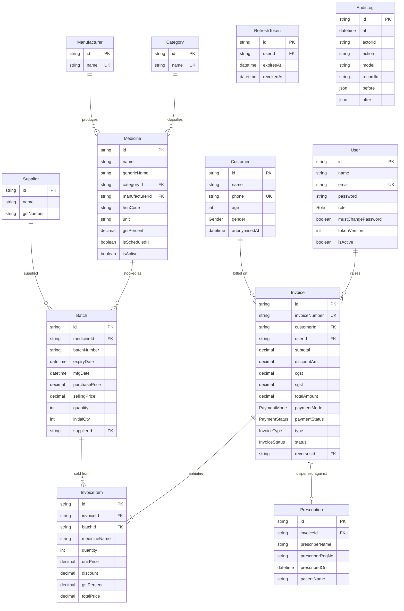

# Data Model

Source of truth: [`backend/prisma/schema.prisma`](../backend/prisma/schema.prisma) · PostgreSQL 15 · Prisma 5.10

All primary keys are **CUID strings** (`@default(cuid())`), not integers — IDs are opaque and safe to expose.

---

## 1. Entity-relationship diagram



`AuditLog` stands apart on purpose: it has **no relation to `User`**, so attribution survives the actor being deleted. `RefreshToken` cascades with its user.

**Reading the cardinalities:** an `Invoice` must have at least one `InvoiceItem` in practice (the validator requires it) though the database does not enforce it. `Invoice.customerId` is nullable — walk-in sales carry no customer. Everything else marked FK is mandatory.

---

## 2. Enumerations

| Enum              | Values                                  | Default        | Used by                   |
| ----------------- | --------------------------------------- | -------------- | ------------------------- |
| `Role`          | `ADMIN`, `PHARMACIST`, `CASHIER`  | `CASHIER`    | `User.role`             |
| `Gender`        | `MALE`, `FEMALE`, `OTHER`         | *(nullable)* | `Customer.gender`       |
| `PaymentMode`   | `CASH`, `UPI`, `CARD`, `CREDIT` | `CASH`       | `Invoice.paymentMode`   |
| `PaymentStatus` | `PAID`, `PENDING`, `PARTIAL`      | `PAID`       | `Invoice.paymentStatus` |
| `InvoiceType`   | `SALE`, `CREDIT_NOTE`               | `SALE`       | `Invoice.type`          |
| `InvoiceStatus` | `ACTIVE`, `CANCELLED`               | `ACTIVE`     | `Invoice.status`        |

`InvoiceType` and `InvoiceStatus` are kept apart from `PaymentStatus` on purpose — see §3.8 and §8.

---

## 3. Table reference

### 3.0 `Shop` — the tenant

Added 2026-08-29. One row per pharmacy. Every other table holding shop-specific data carries a `shopId` back to this, and every query that reads or writes that data filters on it — **that is the whole of the isolation boundary** between one shopkeeper's business and another's.

| Column        | Type     | Constraints | Notes                                                          |
| ------------- | -------- | ----------- | -------------------------------------------------------------- |
| `id`        | String   | PK, cuid    |                                                                |
| `name`      | String   | required    | Printed on the invoice header                                  |
| `address`   | String?  |             | Optional: a shop can bill with a name alone                    |
| `phone`     | String?  |             |                                                                |
| `gstNumber` | String?  |             | The shop's own GSTIN, printed on tax documents                 |
| `drugLicenceNo` | String? |          | Added 2026-08-31. The retail drug licence the shop dispenses under, printed as **D.L. No.** on the invoice header — the reference format carries one for the seller and one for the buyer. Nullable, because a shop that has not entered it yet must still be able to trade |
| `createdAt` | DateTime | auto        | No`updatedAt` — the row is written rarely and audited when it is |

Relations, all one-to-many: `users`, `categories`, `manufacturers`, `medicines`, `batches`, `customers`, `suppliers`, `invoices`, `invoiceCounters`, `auditLogs`.

**There is deliberately no cross-shop relation anywhere in this schema.** Two shops sharing so much as a `Category` row would be an isolation break rather than a convenience, which is why the two lookup tables that used to be global are now per-shop (§3.2). The cost is that each shop types "Tablet" into its own category list once.

Three consequences worth knowing before writing a query:

- **`shopId` comes from the token, never from the request.** It is a JWT claim, read as `req.user.shopId`. No endpoint accepts one in a body or a query string, so there is nothing for a caller to target.
- **Scoped writes are `updateMany` / `deleteMany`, not `update` / `delete`.** Prisma's singular forms accept only a unique selector, so `shopId` could not sit in the same `where` as `id` — it would have to be a separate check after the fact, which makes the boundary a coincidence of control flow rather than a property of the query. The bulk forms take an arbitrary filter, so the tenant condition is *in* the statement; a count of zero is the 404.
- **A foreign id answers 404, not 403.** A 403 would confirm the row exists, turning a guessed id into a probe for another shop's catalogue.

### 3.1 `User`

| Column                        | Type     | Constraints                | Notes                                                                      |
| ----------------------------- | -------- | -------------------------- | -------------------------------------------------------------------------- |
| `id`                        | String   | PK, cuid                   |                                                                            |
| `name`                      | String   | required                   |                                                                            |
| `email`                     | String   | **unique**, required | Login identity; duplicates surface as`409`                               |
| `password`                  | String   | required                   | bcrypt hash, cost 12. Never selected into responses                        |
| `role`                      | Role     | default`CASHIER`         |                                                                            |
| `mustChangePassword`        | Boolean  | default`false`           | Set on the seeded bootstrap admin. While true the API answers`403 PASSWORD_CHANGE_REQUIRED` to every route except reading your own profile and changing your password — the credential is published in this repository, so the account is created unusable rather than merely discouraged (threat T-2) |
| `tokenVersion`              | Int      | default`0`               | Revocation counter (FR-AUTH-09). Every issued token carries the value current when it was signed;`protect` rejects any token whose copy has fallen behind. `POST /api/auth/logout` increments it, ending every session for that account. A counter rather than a timestamp because JWT `iat` is second-granular — a token signed in the same second as a logout would survive it |
| `isActive`                  | Boolean  | default`true`            | `false` blocks login *and* invalidates existing tokens on next request |
| `createdAt` / `updatedAt` | DateTime | auto                       |                                                                            |

Relations: `invoices Invoice[]`, `refreshTokens RefreshToken[]` (§3.14).

> Every user query in the codebase uses an explicit `select` that omits `password` — except the two places that need the hash to compare it (`login`, `changePassword`). Preserve that discipline when adding queries.

### 3.2 `Category`

| Column     | Type   | Constraints                         |
| ---------- | ------ | ----------------------------------- |
| `id`     | String | PK, cuid                            |
| `shopId` | String | FK →`Shop`, indexed              |
| `name`   | String | **unique per shop**, min 2 chars (Zod) |

Relations: `shop Shop`, `medicines Medicine[]`. Hard delete — fails with an FK error if any medicine references it, mapped to a `409`.

> **`@@unique([shopId, name])`, not `@@unique([name])`.** Until 2026-08-29 categories and manufacturers were global lookup tables shared by everyone. Under multi-tenancy that is an isolation break rather than a saving: one shop renaming "Analgesic" would rename it for every other shop, and the list itself would disclose what other pharmacies stock. Each shop now keeps its own, and two shops may both have a "Tablet".

### 3.3 `Manufacturer`

Identical shape to `Category`: `id`, `shopId`, `name` unique **per shop**, `medicines Medicine[]`. Hard delete.

### 3.4 `Medicine`

| Column                        | Type         | Constraints        | Notes                                                                                                                          |
| ----------------------------- | ------------ | ------------------ | ------------------------------------------------------------------------------------------------------------------------------ |
| `id`                        | String       | PK, cuid           |                                                                                                                                |
| `name`                      | String       | required, min 2    | Brand name                                                                                                                     |
| `genericName`               | String?      | optional           | Salt / molecule; searchable                                                                                                    |
| `categoryId`                | String       | FK → Category     |                                                                                                                                |
| `manufacturerId`            | String       | FK → Manufacturer |                                                                                                                                |
| `hsnCode`                   | String?      | optional           | HSN for GST classification; searchable                                                                                         |
| `unit`                      | String       | required           | Constrained by Zod to: tablet, capsule, syrup, injection, cream, drops, powder, inhaler, other —**not** by the database |
| `packSize`                  | String?      | optional, free text | Added 2026-08-31. How the product is packed, copied off the carton as a distributor writes it —`1*15ML`, `1*10`, `1*15GM`. Printed as **PACK** on the invoice. Free text on purpose: it is a label, not a quantity to compute with. **Distinct from `unit`**, which is the dispensing unit — a strip of ten tablets has unit `tablet` and packSize `1*10` |
| `gstPercent`                | Decimal(5,2) | default`12`      | Zod restricts to 0 / 5 / 12 / 18                                                                                               |
| `isScheduledH`              | Boolean      | default`false`   | Prescription-only flag; displayed at POS, not enforced                                                                         |
| `isActive`                  | Boolean      | default`true`    | Soft-delete flag; list and search filter on it                                                                                 |
| `createdAt` / `updatedAt` | DateTime     | auto               |                                                                                                                                |

Relations: `category`, `manufacturer`, `batches Batch[]`.

**No unique constraint on `name`.** Two medicines with the same brand name from different manufacturers are legal — and intended.

**Derived fields** returned by `GET /api/medicines` but *not stored*:

- `totalStock` — true stock across every in-stock batch, from a separate `groupBy` ([G-10](./08-gap-analysis.md#g-10)).
- `nearestExpiry` — expiry of that batch.
- `sellingPrice` — selling price of that batch, `0` when no stock exists.

### 3.5 `Batch` — the stock unit

| Column            | Type          | Constraints                          | Notes                                                                                                             |
| ----------------- | ------------- | ------------------------------------ | ----------------------------------------------------------------------------------------------------------------- |
| `id`            | String        | PK, cuid                             |                                                                                                                   |
| `medicineId`    | String        | FK → Medicine                       |                                                                                                                   |
| `batchNumber`   | String        | required                             | Printed on the manufacturer's pack                                                                                |
| `expiryDate`    | DateTime      | required                             | Drives FEFO ordering and alerts                                                                                   |
| `mfgDate`       | DateTime?     | optional, must precede`expiryDate` | Added by migration`20260419152932_add_mfgdate`; recordable since 2026-08-19 — [G-04](./08-gap-analysis.md#g-04) |
| `purchasePrice` | Decimal(12,2) | > 0                                  | Cost. Never exposed at POS                                                                                        |
| `sellingPrice`  | Decimal(12,2) | > 0                                  | Pre-GST price used as the POS unit price                                                                          |
| `mrp`           | Decimal(12,2)? | optional                            | Added 2026-08-31. Maximum retail price printed on the pack, shown as **MRP** on the invoice. **Per batch, not per medicine** — the same product is repriced between print runs, which is why a pharmacy tracks it against the batch it arrived in. Never used in arithmetic: the sale is priced from `sellingPrice`. Left **blank** on the printed line when unrecorded rather than defaulted from `sellingPrice`, because printing the two as equal asserts on a tax document that no discount was given |
| `quantity`      | Int           | > 0 at creation                      | **Live stock.** Decremented per sale                                                                        |
| `initialQty`    | Int           | set =`quantity` at creation        | Opening stock, for depletion analysis                                                                             |
| `supplierId`    | String        | FK → Supplier                       |                                                                                                                   |
| `createdAt`     | DateTime      | auto                                 |                                                                                                                   |

**Unique:** `@@unique([medicineId, batchNumber])` — the same batch number can recur across different medicines, never within one.

Relations: `shop`, `medicine`, `supplier`, `invoiceItems`. *(`purchaseItems` was listed here until 2026-08-31; the purchases tables were dropped on 2026-08-24.)*

> `quantity` is guarded twice. The mechanism is the conditional `updateMany` inside the invoice transaction, so a concurrent sale cannot drive it negative ([G-09](./08-gap-analysis.md#g-09)); the **backstop** is a database `CHECK (quantity >= 0)`, added on 2026-08-20 as `Batch_quantity_non_negative` (§4). Prisma cannot express CHECK, so it exists only in migration `20260820052324_add_batch_quantity_check` and is invisible in `schema.prisma`.

### 3.6 `Supplier`

| Column          | Type     | Constraints                           |
| --------------- | -------- | ------------------------------------- |
| `id`          | String   | PK, cuid                              |
| `name`        | String   | required, min 2                       |
| `contactName` | String?  | optional                              |
| `phone`       | String?  | optional                              |
| `email`       | String?  | optional, email format when non-empty |
| `gstNumber`   | String?  | optional — supplier GSTIN            |
| `address`     | String?  | optional                              |
| `createdAt`   | DateTime | auto                                  |

Relations: `batches Batch[]`. Hard delete; fails with an FK error once any batch references the supplier.

### 3.7 `Customer`

| Column        | Type     | Constraints                   | Notes                                  |
| ------------- | -------- | ----------------------------- | -------------------------------------- |
| `id`        | String   | PK, cuid                      |                                        |
| `name`      | String   | required, min 2               |                                        |
| `phone`     | String?  | **unique** when present | The de facto lookup key at the counter |
| `email`     | String?  | optional                      |                                        |
| `address`   | String?  | optional                      |                                        |
| `age`       | Int?     | 0–150 (Zod)                  |                                        |
| `gender`    | Gender?  | optional                      |                                        |
| `createdAt` | DateTime | auto                          |                                        |

Relations: `invoices Invoice[]`. **No `updatedAt`, no soft delete, no delete route.**

### 3.8 `Invoice`

| Column            | Type          | Constraints              | Notes                                                                         |
| ----------------- | ------------- | ------------------------ | ----------------------------------------------------------------------------- |
| `id`            | String        | PK, cuid                 |                                                                               |
| `invoiceNumber` | String        | **unique**         | `INVyymmdd-nnnn`                                                            |
| `customerId`    | String?       | FK → Customer, nullable | Null = walk-in                                                                |
| `userId`        | String        | FK → User               | Operator who raised it                                                        |
| `date`          | DateTime      | default now              | Business date used by every report filter                                     |
| `subtotal`      | Decimal(12,2) |                          | Σ of**rounded** line taxable values (after line discounts, before tax) |
| `discountAmt`   | Decimal(12,2) | default 0                | Bill-level flat discount, applied post-tax                                    |
| `cgst`          | Decimal(12,2) | default 0                | Σ rounded line CGST                                                          |
| `sgst`          | Decimal(12,2) | default 0                | Σ rounded line SGST                                                          |
| `totalAmount`   | Decimal(12,2) |                          | `subtotal + cgst + sgst − discountAmt`, exactly                            |
| `paymentMode`   | PaymentMode   | default`CASH`          |                                                                               |
| `paymentStatus` | PaymentStatus | default`PAID`          | Only`PAID` invoices enter the GST report                                    |
| `type`          | InvoiceType   | default`SALE`          | `SALE` or `CREDIT_NOTE`. A credit note carries **negated** money on every field and a `CRNyymmdd-nnnn` serial from its own series |
| `status`        | InvoiceStatus | default`ACTIVE`        | `ACTIVE` or `CANCELLED`. **The only column a void changes** — number, date, totals and lines are exactly what was issued |
| `reversesId`    | String?       | **unique**, FK → Invoice | Set on a credit note: the sale it reverses. Null on a sale. The unique index is what makes a double-submitted void restore stock exactly once |
| `notes`         | String?       | optional                 |                                                                               |
| `createdAt`     | DateTime      | auto                     | Distinct from`date`; invoice numbering counts on `createdAt`              |

Relations: `customer?`, `user`, `items InvoiceItem[]`, plus the self-relation `reverses` / `reversedBy` on `reversesId`.

> **`type` and `status` are deliberately separate from `paymentStatus`.** "Was it paid" and "is it a reversal" are orthogonal questions, and folding `CANCELLED` into `PaymentStatus` would have dropped a voided invoice out of the GST report — which filters on `PAID` — silently rewriting a tax period that may already have been filed. See §8.

> `date` and `createdAt` both default to now and never diverge today, but reports filter on `date` while `generateInvoiceNumber()` counts on `createdAt`. If back-dated invoices are ever allowed, these will disagree.

### 3.9 `InvoiceItem`

| Column           | Type          | Notes                                                                                           |
| ---------------- | ------------- | ----------------------------------------------------------------------------------------------- |
| `id`           | String        | PK, cuid                                                                                        |
| `invoiceId`    | String        | FK → Invoice                                                                                   |
| `batchId`      | String        | FK → Batch — ties the sale to the exact physical stock, which is what makes recalls traceable |
| `medicineName` | String        | **Snapshot** at time of sale                                                              |
| `quantity`     | Int           | Units sold                                                                                      |
| `unitPrice`    | Decimal(12,2) | Snapshot of batch selling price                                                                 |
| `discount`     | Decimal(5,2)  | Line discount**percentage**, default 0                                                    |
| `gstPercent`   | Decimal(5,2)  | Snapshot of the medicine's rate                                                                 |
| `totalPrice`   | Decimal(12,2) | `taxable + cgst + sgst`, built from the rounded parts                                         |

Not stored, recomputable: line taxable value, line CGST, line SGST.

### 3.10 `InvoiceCounter` — invoice serial allocation

| Column  | Type   | Constraints | Notes                                          |
| ------- | ------ | ----------- | ---------------------------------------------- |
| `day` | String | PK          | `yymmdd`, matching the invoice-number prefix |
| `seq` | Int    | required    | Last serial handed out for that day            |

One row per business day. `generateInvoiceNumber()` runs a single `INSERT … ON CONFLICT ("day") DO UPDATE SET seq = seq + 1 RETURNING seq` **inside the invoice transaction**, so concurrent checkouts queue on the row lock and each receives a distinct serial. Because the increment shares the invoice's transaction, a rolled-back sale returns its number — serials stay gapless, which matters for a tax document.

When the row is first created for a day it seeds itself from the invoices already recorded that day, so days written before this table existed continue where they left off rather than colliding.

This is the only raw SQL in the codebase; the atomicity guarantee is the reason.

### 3.11 `Prescription` — the Schedule H register

| Column              | Type      | Notes                                                                                              |
| ------------------- | --------- | ---------------------------------------------------------------------------------------------------- |
| `id`              | String    | PK, cuid                                                                                           |
| `invoiceId`       | String    | **unique**, FK → Invoice. One prescription per bill                                          |
| `prescriberName`  | String    | The registered medical practitioner who wrote it                                                   |
| `prescriberRegNo` | String    | Their council registration number. Indexed — "everything dispensed against this prescriber" is what an inspection asks. Deliberately not pattern-matched: formats differ by state council and a wrong regex would block a lawful sale |
| `prescribedOn`    | DateTime  | The date on the prescription, which is**not** the date of supply. Indexed. A future date is rejected |
| `patientName`     | String    | Named separately from`Invoice.customerId`, which is nullable — a Schedule H walk-in still needs a patient on the register |
| `notes`           | String?   | Optional                                                                                           |
| `createdAt`       | DateTime  | auto                                                                                               |

**Why this exists.** Rule 65(11) of the Drugs and Cosmetics Rules lets a pharmacy record the *particulars* of a prescription in a register rather than retain the paper. Most of those particulars are already here — date of supply, drugs, quantities and the dispensing pharmacist are the invoice, its lines and `Invoice.userId`. The prescriber, the prescription's own date and the patient are what was missing.

**Enforced from the batch, not the request.** An invoice line carries a `medicineId` that is validated but never persisted, so it cannot be what decides whether a prescription is required — a caller could pair a Schedule H batch with a harmless `medicineId`. The controller resolves the medicine through `batch.medicineId`.

**Written in the invoice's transaction.** A Schedule H invoice without its register entry is exactly the gap this closes, so the two cannot come apart: a rolled-back sale leaves no orphan entry.

**Produced by `GET /api/reports/prescriptions`, since 2026-09-01.** The two indexes above were added on 2026-08-24 for a query nothing made: for eight days the register was written and could not be read except from a `psql` prompt, which is not "able to produce" in the sense Rule 65(11) means. The endpoint filters on `prescribedOn` rather than the invoice date, for the reason the column's own note gives.

**No image, deliberately.** The rules permit the register in lieu of the paper; this stack has no file storage; and a scan would be a second copy of patient-identifying data with its own retention and erasure obligations. Adding one later does not disturb these columns.

> **`patientName` is not reached by customer erasure.** The register is a statutory record the pharmacy is required to be able to produce, and a right to erasure does not override an obligation to retain — the same reasoning that keeps the invoice. An erased customer's name therefore disappears from `Customer` and from the audit trail, and survives in the register of any Schedule H medicine they were dispensed. See §8.

### 3.11a `PasswordResetToken` — a pending self-service reset

Added 2026-08-31 (FR-AUTH-11), migration `20260901104630_add_password_reset_tokens`.

| Column        | Type      | Notes                                                                                       |
| ------------- | --------- | ------------------------------------------------------------------------------------------- |
| `id`        | String    | PK, cuid                                                                                    |
| `userId`    | String    | FK →`User`, `ON DELETE CASCADE`, indexed                                                |
| `tokenHash` | String    | **unique.** SHA-256 of the token that was emailed — the token itself is never stored      |
| `expiresAt` | DateTime  | Indexed. 30 minutes from issue                                                              |
| `usedAt`    | DateTime? | Null while live. Set when spent, when superseded, or when the account resets                |
| `createdAt` | DateTime  | auto                                                                                        |

**The token is never in the table.** `tokenHash` is a digest of the value that went out by email, so a backup, a dump or an operator with a `psql` prompt cannot mint a reset from what they can see. **SHA-256 rather than bcrypt, deliberately**: the input is 32 bytes of `randomBytes`, not a human-chosen password, so there is no dictionary to run against it — a slow hash would buy nothing and make every lookup slow.

**Single use is `usedAt`, not deletion.** A row that records having been spent distinguishes "this link was already used" from "this link never existed". Only the first tells an operator that somebody clicked twice rather than that somebody is guessing — even though, deliberately, the *caller* is told the same thing either way.

**Rows are spent, not only expired**, in three places: when the link is used, when a newer request supersedes it, and when any reset completes for that account. The last two matter because the mailbox holding the older link may be the reason for the reset.

### 3.12 `AuditLog` — who changed what

| Column         | Type      | Notes                                                                                                  |
| -------------- | --------- | ------------------------------------------------------------------------------------------------------ |
| `id`         | String    | PK, cuid                                                                                               |
| `at`         | DateTime  | default now. Indexed — the usual query is "what happened in this window"                              |
| `actorId`    | String?   | **No foreign key, deliberately.** Null for writes with no signed-in user            |
| `actorEmail` | String?   | Snapshot of the actor's address at the time                                                            |
| `action`     | String    | `CREATE` · `UPDATE` · `DELETE`                                                                   |
| `model`      | String    | The Prisma model written to, e.g.`Batch`                                                             |
| `recordId`   | String?   | Indexed with`model` — "the history of this batch" is the second query                               |
| `before`     | Json?     | Prior state. Null on a create                                                                          |
| `after`      | Json?     | Resulting state. Null on a delete                                                                      |
| `reason`     | String?   | Why, when the handler supplied one. Most writes have nothing to add beyond before/after; a manual stock adjustment is meaningless without it, so that endpoint requires one |
| `requestId`  | String?   | The`X-Request-Id` of the causing request, so a row joins to that request's log lines                 |

**No relation to `User`.** A foreign key would either block deleting an account or null the column out, and a trail that forgets who did something the moment their account is removed is not a trail. `actorId` and `actorEmail` are therefore copies.

**Written by a Prisma client extension** (`config/audit.js`), not by controllers, so a new write path records itself without being asked. The actor reaches the data layer through an `AsyncLocalStorage` context set per request — the data layer has no idea a request exists, and threading an actor through every call would put the remembering back into the controllers.

**It was a Prisma middleware (`$use`) until 2026-08-31**, and the change is worth understanding before touching this file, because it fixed two things at once. A middleware cannot see the transaction its caller is in, so its reads and its `AuditLog` insert went out on the *global* client while the caller's transaction still held a pooled connection:

- **Every audited write inside a transaction cost two connections**, so N concurrent voids deadlocked once N passed half the pool. Measured: twelve concurrent partial returns produced **zero** successes, all of them dying on pool exhaustion and the 5s transaction timeout. `tests/billing/invoice-void.test.js` had capped its own concurrency at four to stay underneath — a test written around a defect rather than against it.
- **The audit row outlived a write that rolled back**, since it committed on its own connection. A rolled-back sale left a row claiming a change that never happened.

An extension alone does not fix this — Prisma gives a `query` extension no handle on the caller's transaction either. `config/db.js` wraps `$transaction` so its callback runs inside a second `AsyncLocalStorage` holding the transaction client, and the extension writes through whatever it finds there. The same trick as the actor, for the same reason.

Two consequences of that are worth knowing:

- **The `before` read is now correct inside a transaction.** On the global client it could not see the transaction's own uncommitted writes, so a second edit to the same row in one transaction recorded the state from before the *first*.
- **The array form `$transaction([...])` is unchanged.** Prisma exposes no client for it, so its audit rows still commit independently. It is used only for a few uncontended account writes.

Guarded by `tests/audit/audit-log.test.js` — a rolled-back transaction must leave no audit row, and a committed one must still leave a correct one. Both fail if anyone reverts to `$use` or drops the wrapper; verified by doing exactly that.

**What is covered:** `Medicine`, `Batch`, `Supplier`, `Category`, `Manufacturer`, `Customer`, `User`, for single-record `create`, `update` and `delete`.

**What is not, and why:**

| Excluded                     | Reason                                                                                                                                    |
| ---------------------------- | ------------------------------------------------------------------------------------------------------------------------------------------- |
| `Invoice` / `InvoiceItem` | Already attributed by`Invoice.userId`, append-only, never edited. Auditing them would double the write volume of the hottest path to restate what is already recorded |
| `RefreshToken`             | Churns by design — a 30-minute access token means each device rotates one about 48 times a day, which would bury everything worth reading  |
| `InvoiceCounter`           | A serial allocator, not business data                                                                                                       |
| `AuditLog`                 | Auditing the audit log does not terminate                                                                                                   |
| `updateMany` / `deleteMany` **unless a reason is declared** | The one that matters is the stock decrement inside invoice creation, which is attributable through its invoice. A handler that calls `setReason` is stating the write is worth recording, which opts it back in — that is how manual stock adjustment (FR-BATCH-11) is audited while the sale stays out. The resulting state is read back, since a bulk write returns a count rather than a row. *(This row used to carry a second reason — that the audit write could not join the sale's transaction, so a rollback would leave a row claiming stock moved. **That is no longer true as of 2026-08-31** and is recorded rather than deleted, because it was real. The volume argument stands on its own.)* |

**`password` and `tokenVersion` are stripped** from both `before` and `after`. An audit row must never become a second place credential material lives.

**Failure is non-fatal outside a transaction.** If the audit insert throws, the error is logged and the original write still succeeds. A lost audit row is a gap in a record; a rejected write is a pharmacist who cannot do their job.

**Inside a transaction it is fatal, deliberately, since 2026-08-31.** Now that the insert shares the caller's transaction, a failed statement has already aborted it at the database — swallowing the error would hide the cause and surface it later as an unrelated *"current transaction is aborted"* on the caller's next statement. Letting it propagate rolls the write back with a message naming what actually failed.

#### Retention — decided 2026-08-22

**Keep for 24 months, then purge.** Enforced since 2026-08-31 by `npm run purge:audit` (`src/utils/audit-retention.js`) — reports what it would delete and how old, `-- --apply` to do it. **It never runs itself**: the same arrangement as the customer purge and `scripts/backup.sh`, because there is no background worker in this stack by design ([02 §1](./02-architecture.md)). Between 2026-08-22 and that date the policy was decided and unenforced, so the table grew without bound while four documents described a rule that was not in force.

Two properties worth knowing before changing it:

- **It is not scoped by shop**, which is the one place in this codebase that is deliberate rather than an oversight. Retention is a property of the installation the operator runs, applied on one clock to every tenant; a per-shop sweep would let one shop's operator keep what another had purged.
- **It writes no audit rows of its own.** `AuditLog` is absent from the audited model set, so the sweep's `deleteMany` passes through the extension untouched. A purge that audited itself could never shrink the table — it would replace every row it removed.

**How it interacts with customer erasure**, since both act on the same rows: it cannot undermine it, because **deleting a row is strictly stronger than redacting one**. Redaction exists so an audit row stops holding a copy of data erased everywhere else; a purge that removed the row first achieves that and more. And nothing depends on a row still being there — `redactAuditTrail` is an `updateMany`, so matching zero rows is a no-op rather than a failure, and an erasure whose audit history has already aged out still succeeds and still leaves nothing personal behind. Asserted in `tests/audit/audit-retention.test.js` rather than reasoned about, because it is the claim here that would be expensive to have wrong.

**The row recording an erasure gets no carve-out.** It ages on this same 24-month clock. The paragraph below says audit retention must outlive the customer-retention period; it was written while [PRD Q6](./01-product-requirements.md#14-open-questions) was open and the number unknown, and Q6 landed at 36 months — longer than 24. The two are not in conflict: they measure different things from different origins, 36 months from a customer's last purchase against 24 from an individual write. What the constraint actually asks for is that an erasure stay auditable for a good while after it happens, and two years is that. Exempting erasure rows so they outlive everything else would be a different policy from the one decided.

Two constraints shaped the number. It must **outlive the customer-retention period** ([PRD Q6](./01-product-requirements.md#14-open-questions), still open), because an erasure needs to be auditable — deleting a customer without a record of who deleted them replaces one gap with another. And it must be long enough to answer "who changed this price" across at least one full annual cycle of GST filings, since that is when a wrong figure typically surfaces.

> **Erasure and audit pull in opposite directions.** `before`/`after` on a `Customer` write contains that customer's own data, so an audit row can outlive the erasure it records. When the retention decision in [PRD Q6](./01-product-requirements.md#14-open-questions) lands, the erasure path must either redact customer PII from historical audit rows or accept the residue explicitly. It cannot be left to be discovered.

#### Reads are not logged — decided 2026-08-22

Threat [T-9](./07-security.md#9-threat-model) is insider exfiltration: any authenticated role can page through every customer's purchase history and nothing records it. **Row-level read logging is still the wrong answer here**, and it is worth saying why rather than leaving it looking like an oversight.

The POS search fires on every keystroke, and the dashboard reads batches on every load. Logging reads would multiply audit volume by the *read* volume — orders of magnitude more rows than the writes anyone wants to inspect — and would bury the price and stock changes this table exists for. It would also make the audit log itself a bulk store of customer-access patterns, which is more sensitive data, not less.

The honest mitigation for T-9 is **restricting who can read customer history** ([07 §3](./07-security.md#3-authorisation)), not recording that everyone did. Revisit if staff numbers grow past the point where "everyone here can see everything" stops being an accurate description of the shop.

### 3.13 `Purchase` / `PurchaseItem` — removed

Both tables existed from the initial migration and never acquired a write path: no controller, no route, no validator, no UI. `generatePurchaseNumber()` was written and never called. The only code that referenced them made `GET /api/suppliers/:id` return a `purchases` array that was always empty — a false claim rather than a true one about a supplier with no history.

**Decided 2026-08-24 (PRD Q7): the schema was deleted, not built.** The control it looked like it would provide already existed — `Batch` carries `supplierId` and `purchasePrice`, and the audit log records who created it, so stock already has a traceable cause and a cost. What Phase 10 would add on top is purchase-level grouping, supplier payables and margin reporting: features nobody asked for in the four months since 1.0.0. The design survives in git history and in this document, so procurement can be built later against real requirements rather than an April 2026 guess.

Dropped in migration `20260824111521_drop_purchases`, verified empty (0 rows in both) beforehand.

### 3.14 `RefreshToken` — one row per signed-in device

Added 2026-08-22 with refresh rotation (FR-AUTH-10). Numbered last rather than
beside `User`, where it belongs conceptually, because renumbering ten sections
would break every cross-reference into them — including the ones pointing at
§3.11 and §3.12.

| Column        | Type      | Notes                                                                                          |
| ------------- | --------- | ---------------------------------------------------------------------------------------------- |
| `id`        | String    | PK, cuid. **This is the refresh token's `jti`** — the token is a pointer to this row, not a bearer of its own authority |
| `userId`    | String    | FK → User, `ON DELETE CASCADE`. Deleting a user takes their sessions with them              |
| `expiresAt` | DateTime  | Seven days from issue                                                                          |
| `revokedAt` | DateTime? | Set the moment the token is rotated or the session ends. **A presented token whose row is already revoked is the reuse signal** |
| `createdAt` | DateTime  | default now                                                                                    |

Indexed on `userId`, which is the only way it is ever queried — revoking every
session for an account.

**Why the server holds state for a stateless credential.** The access token is a
plain JWT and is verified without a lookup; the refresh token is not, and that
asymmetry is the point. Rotation means every use revokes the row it was issued
against and creates a new one, so presenting an already-revoked row means two
parties hold the same credential. A legitimate client never does that. The
response is to treat it as theft and end every session for that user, the honest
one included — losing a session beats leaving somebody else in one.

**Deliberately not audited** ([§3.12](#312-auditlog--who-changed-what)). With
30-minute access tokens each device rotates one roughly 48 times a day, so
auditing this table would bury the rows anyone actually wants to read.

Revocation has two halves and needs both: `User.tokenVersion` invalidates
outstanding **access** tokens, and revoking these rows stops new ones being
minted. `POST /api/auth/logout`, a password change, an administrator's password
reset and deactivating an account all do both.

## 4. Indexes and constraints

### Present

| Type             | Where                                                                                                                                |
| ---------------- | ------------------------------------------------------------------------------------------------------------------------------------ |
| Primary key      | Every table (`id`)                                                                                                                 |
| Unique           | `User.email`, `Category.name`, `Manufacturer.name`, `Customer.phone`, `Invoice.invoiceNumber`, `Purchase.purchaseNumber` |
| Composite unique | `Batch(medicineId, batchNumber)`                                                                                                   |
| Foreign keys     | All relations above; Postgres auto-indexes the referenced side only                                                                  |

### Added 2026-08-20

Before this the schema had **no custom indexes at all** — only primary keys and unique constraints — so every one of these tables was on a sequential scan. Six come from `@@index` declarations in `schema.prisma`; the seventh cannot be expressed there. All are in migration `20260820115654_add_performance_indexes`.

| Index                                             | Serves                            | Effect                                                                                                                                                                                  |
| ------------------------------------------------- | --------------------------------- | --------------------------------------------------------------------------------------------------------------------------------------------------------------------------------------- |
| `Batch_expiryDate_idx`                          | expiry alerts, FEFO ordering      | Hit on every dashboard load and every POS search                                                                                                                                        |
| `Batch_quantity_idx`                            | low-stock report                  | Was a full scan                                                                                                                                                                         |
| `Batch_medicineId_idx`                          | POS search join                   | Prisma does not create FK-side indexes automatically, so this join had none                                                                                                             |
| `Invoice_date_idx`                              | every report and the invoice list | The hottest filter in the reporting layer. The invoice list went from a Seq Scan at cost 730 to an Index Scan at 36                                                                     |
| `Invoice_customerId_idx`                        | customer history                  |                                                                                                                                                                                         |
| `InvoiceItem_invoiceId_idx`                     | invoice detail/print              |                                                                                                                                                                                         |
| `Medicine_name_generic_trgm_idx`                | POS search                        | **GIN over `pg_trgm`**, on `name` and `COALESCE(genericName, '')`. `ILIKE '%q%'` has a leading wildcard, which no b-tree can serve. 824 kB |

**Two things live only in migration history**, because `schema.prisma` cannot express either. `prisma migrate dev` will not regenerate them, and `prisma db push` against a scratch database will not create them:

| Object                              | Migration                                     | What it is                                                                                                                            |
| ----------------------------------- | --------------------------------------------- | ------------------------------------------------------------------------------------------------------------------------------------- |
| `Batch_quantity_non_negative`     | `20260820052324_add_batch_quantity_check`   | `CHECK ("quantity" >= 0)` — invariant I-1's database backstop. Verified against live data before applying: 0 rows were negative |
| `Medicine_name_generic_trgm_idx`  | `20260820115654_add_performance_indexes`    | The GIN index above, plus`CREATE EXTENSION IF NOT EXISTS pg_trgm`                                                                   |

`schema.prisma` carries doc comments on `Batch.quantity` and the `Medicine` model pointing at both, so they are not invisible to someone reading the model.

> The trigram index is **pre-emptive**. It is used for a selective search term, but at 10,000 medicines the planner still prefers a sequential scan for a common one — the index earns its place as the catalogue grows, not today.

---

## 5. Invariants

These must hold at all times. Any new write path must preserve them.

| #   | Invariant                                                       | Enforced by                                                                                                                                                                                                                                                                           |
| --- | --------------------------------------------------------------- | ------------------------------------------------------------------------------------------------------------------------------------------------------------------------------------------------------------------------------------------------------------------------------------- |
| I-1 | `Batch.quantity ≥ 0`                                         | **Enforced by the database** — `CHECK ("quantity" >= 0)`, constraint `Batch_quantity_non_negative`, added 2026-08-20. The conditional decrement inside the invoice transaction remains the mechanism; the constraint is the backstop for write paths that do not exist yet |
| I-2 | `Batch.quantity ≤ initialQty`                                | Nothing. Batch update can raise quantity arbitrarily                                                                                                                                                                                                                                  |
| I-3 | Every`InvoiceItem` points at a real `Batch`                 | FK                                                                                                                                                                                                                                                                                    |
| I-4 | `Invoice.totalAmount = subtotal + cgst + sgst − discountAmt` | Application (`billing.controller.js`)                                                                                                                                                                                                                                               |
| I-5 | `Invoice.cgst = Invoice.sgst`                                 | Application — the 50/50 split is unconditional                                                                                                                                                                                                                                       |
| I-6 | `invoiceNumber` is unique and gapless per day                 | DB unique constraint + the atomic`InvoiceCounter` upsert inside the invoice transaction                                                                                                                                                                                             |
| I-7 | Deactivating a user immediately denies access                   | `protect` reloads and checks `isActive`                                                                                                                                                                                                                                           |
| I-8 | Soft-deleted medicines never appear in list or search           | `where: { isActive: true }` in both queries                                                                                                                                                                                                                                         |
| I-9 | Sold-out batches never appear at POS                            | `where: { quantity: { gt: 0 } }` in search                                                                                                                                                                                                                                          |

---

## 6. Migration history

| Migration                              | Date       | Contents                                             |
| -------------------------------------- | ---------- | ---------------------------------------------------- |
| `20260418054922_init`                     | 2026-04-18 | All 11 tables, 4 enums, all constraints                                                                                                                            |
| `20260419152932_add_mfgdate`              | 2026-04-19 | Adds nullable`Batch.mfgDate`                                                                                                                                     |
| `20260818171902_add_invoice_counter`      | 2026-08-18 | Adds`InvoiceCounter` for race-free invoice serials ([G-01](./08-gap-analysis.md#g-01))                                                                            |
| `20260819153025_money_to_decimal`         | 2026-08-19 | Money →`DECIMAL(12,2)`, rates → `DECIMAL(5,2)` ([G-07](./08-gap-analysis.md#g-07))                                                                          |
| `20260820052324_add_batch_quantity_check` | 2026-08-20 | **Hand-written.** `CHECK ("quantity" >= 0)` on `Batch` as `Batch_quantity_non_negative` — invariant I-1's backstop. Prisma cannot express CHECK |
| `20260820111401_add_must_change_password` | 2026-08-20 | Adds`User.mustChangePassword`, default `false`. Ships the forced-password-change control for the seeded admin (threat T-2)                                    |
| `20260820115654_add_performance_indexes`  | 2026-08-20 | Six b-tree indexes from`@@index` declarations, plus `CREATE EXTENSION pg_trgm` and the GIN index Prisma cannot express. See §4                                |
| `20260820132000_add_invoice_void`         | 2026-08-20 | Adds the`InvoiceType` and `InvoiceStatus` enums, `Invoice.type` / `status` / `reversesId`, the **unique** index on `reversesId` and its self-FK ([G-15](./08-gap-analysis.md#g-15)) |
| `20260822140056_add_token_version`        | 2026-08-22 | Adds`User.tokenVersion`, default `0` — the revocation counter behind `POST /api/auth/logout` (FR-AUTH-09)                                                    |
| `20260822143539_add_refresh_tokens`       | 2026-08-22 | Adds the`RefreshToken` table (one row per signed-in device, `ON DELETE CASCADE`) — the state behind rotation and reuse detection (FR-AUTH-10)                |
| `20260822154410_add_audit_log`            | 2026-08-22 | Adds the`AuditLog` table — attribution for every write to master data (NFR-17, threat T-12). See §3.12                                                     |
| `20260824032314_add_customer_anonymised_at` | 2026-08-24 | Adds`Customer.anonymisedAt` and its index — the erasure and retention path (PRD Q6). See §8                                                               |
| `20260824105655_add_prescription`           | 2026-08-24 | Adds the`Prescription` table — the Schedule H register (FR-MED-12, PRD Q4). See §3.11                                                                     |
| `20260824111521_drop_purchases`      | 2026-08-24 | **Drops** `Purchase` and `PurchaseItem` — modelled in the initial migration, never given a write path (PRD Q7). Verified empty first |
| `20260824112334_add_audit_reason`        | 2026-08-24 | Adds`AuditLog.reason` — the "why" behind an audited write, required by manual stock adjustment (FR-BATCH-11) |
| `20260824113643_add_partial_returns`     | 2026-08-24 | Adds`InvoiceItem.returnedQty` and **drops** the unique index on `Invoice.reversesId`. A sale may now have several credit notes, so the single-shot guarantee moves from that index to a cumulative per-line counter applied with a conditional update (FR-BILL-17) |
| `20260828120000_add_shops_multi_tenant`  | 2026-08-28 | Adds the`Shop` table and a `shopId` on User, Category, Manufacturer, Medicine, Batch, Customer, Supplier, Invoice, InvoiceCounter and AuditLog, with an index on each. Re-keys `Category` and `Manufacturer` to `@@unique([shopId, name])`, `Customer` to `@@unique([shopId, phone])`, `Invoice` to `@@unique([shopId, invoiceNumber])`, and `InvoiceCounter` to `@@id([shopId, day])`. See §3.0 |
| `20260830190000_drop_stale_global_unique_indexes` | 2026-08-30 | **Hand-written.** Drops`Category_name_key`, `Manufacturer_name_key`, `Customer_phone_key` and `Invoice_invoiceNumber_key`, which the multi-tenant migration meant to remove and did not — it used `ALTER TABLE ... DROP CONSTRAINT IF EXISTS`, and Prisma writes `@unique` as a bare `CREATE UNIQUE INDEX`, so all four missed silently. See the note below |
| `20260901104630_add_password_reset_tokens` | 2026-09-01 | Adds `PasswordResetToken` — the state behind self-service password reset (FR-AUTH-11). See §3.11a |
| `20260831123451_add_pack_mrp_and_drug_licence` | 2026-08-31 | Adds three nullable columns the printed invoice needs and had nowhere to read: `Medicine.packSize`, `Batch.mrp` and `Shop.drugLicenceNo`. All nullable and none defaulted — see §3.4, §3.5 and §3.0 for why `mrp` in particular is not derived from `sellingPrice` |

All 20 are applied — confirmed against `_prisma_migrations` on 2026-09-01. Two of them contain SQL that exists **only** in migration history and cannot be reproduced from `schema.prisma`; see the note in §4 before rebuilding a database with `db push`.

Workflow:

```bash
npx prisma migrate dev --name <change>   # author + apply locally
npx prisma migrate deploy                # apply in CI/production
npx prisma generate                      # regenerate the client
npx prisma studio                        # browse data
```

The client is generated for `["native", "linux-musl-openssl-3.0.x"]` so the same generated client works on the host and inside Alpine-based images.

---

### A migration that half-applied without saying so

`20260828120000_add_shops_multi_tenant` re-keyed four columns from global to per-shop and removed the old keys with `ALTER TABLE "Category" DROP CONSTRAINT IF EXISTS "Category_name_key"`. Prisma emits `@unique` as a bare `CREATE UNIQUE INDEX`, not a table constraint, so `DROP CONSTRAINT` matched nothing — and `IF EXISTS` turned the miss into a silent success. The migration reported applied, the per-shop keys were added *alongside* the global ones, and `_prisma_migrations` said tenancy had landed.

It ran undetected for two days because the development database had only ever had one real shop. What it cost, measured before the fix:

- **`Invoice_invoiceNumber_key` — the severe one.** Serials restart at `-0001` per shop per day, so the **second shop to sell on any given day could not sell at all**: `409 A record with this value already exists`. `createInvoice`'s `P2002` retry could not help, because every attempt re-derives the same per-shop serial.
- **`Category_name_key` / `Manufacturer_name_key`** — a new shop could not create a category any other shop had already named. Whoever typed "Tablet" first held it system-wide.
- **`Customer_phone_key`** — two shops could not both hold a customer with the same phone, which for two chemists on one street is ordinary.

**When dropping a Prisma `@unique` by hand, use `DROP INDEX IF EXISTS`.** `DROP CONSTRAINT IF EXISTS` is not the same statement and will not tell you it did nothing. The guard is behavioural rather than a check on the index list — `backend/tests/auth/signup.test.js` asserts two shops can hold the same category name, the same customer phone and the same invoice number.

---

## 7. Seed data

`npm run seed` ([seed.js](../backend/src/utils/seed.js)) upserts a single admin:

```
email:    admin@medstore.com
password: admin123
role:     ADMIN
```

Idempotent (`upsert` on email). **Change this password immediately on any non-local deployment** — the credential is in the repository. No categories, manufacturers, medicines or suppliers are seeded, so a fresh database needs masters created before the first batch can be added.

---

## 8. Data lifecycle & retention

| Entity                  | Created by         | Updated by        | Deleted                              |
| ----------------------- | ------------------ | ----------------- | ------------------------------------ |
| User                    | Admin              | Admin / self      | Hard delete (not self)               |
| Category / Manufacturer | Admin, Pharmacist  | same              | Hard delete (FK-blocked when in use) |
| Medicine                | Admin, Pharmacist  | same              | **Soft** (`isActive=false`)  |
| Batch                   | Admin, Pharmacist  | same + every sale | Never                                |
| Supplier                | Admin, Pharmacist  | same              | Hard delete (FK-blocked when in use) |
| Customer                | Any user           | Any user          | Never — no route                    |
| Invoice / InvoiceItem   | Any user (on sale) | Only `status`, on void (ADMIN) | Never                                |

**Invoices are append-only, and a void is not an exception to that.** Since 2026-08-20 an ADMIN can void a sale (FR-BILL-17, [G-15](./08-gap-analysis.md#g-15)), but the original is never rewritten: its number, date, totals and lines are exactly what was issued, and only `status` moves to `CANCELLED`. The correction is a separate dated credit note (`type: CREDIT_NOTE`) carrying negated amounts and a `reversesId` back-reference, with the sold units returned to their original batches in the same transaction.

This is why `type` and `status` are separate enums from `PaymentStatus`. A cancelled invoice stays in the GST report for the month it was issued in and the credit note lands in the month of the void — folding `CANCELLED` into `PaymentStatus` would have dropped it out of a possibly-filed period silently, since that report filters on `PAID`.

Partial returns are not supported: a void reverses a whole invoice.

**How a void is counted, as opposed to how it is dated.** The period rule above settles *when* each document appears. This settles *what a count means*, and it follows from the same principle — a period, once written, is not rewritten:

| Figure | Covers | Why |
|---|---|---|
| `totalInvoices` | `type: SALE` in the period, **any `status`** | A sale raised on the 20th and voided on the 25th was still raised on the 20th. Excluding cancelled sales would silently drop the 20th's count five days later, which is precisely the retroactive edit the void design exists to prevent |
| `creditNotes` | `type: CREDIT_NOTE` in the period | The reversals issued in that period, shown separately so the netting below is legible rather than a day that mysteriously took less than its invoices add up to |
| `totalSales`, `totalCgst`, `totalSgst`, `totalGst` | **Every** document in the period | Sales and credit notes together, so takings are net of anything reversed. Unchanged by this rule — the money was always right |
| `byPaymentMode[]._sum` | Every document of that mode | Net, so the modes still add up to `totalSales` — a cash refund reduces the cash drawer |
| `byPaymentMode[]._count.id` | `type: SALE` of that mode | So the per-mode bill counts add up to `totalInvoices` instead of exceeding it by the number of voids |
| Trend `invoices` / `sales` | Same split: sales counted, money netted | A bar reading "1 invoice, ₹0" is not a thing that can happen |

Applies to `GET /api/reports/daily-summary`, `GET /api/reports/trend` and `GET /api/dashboard/stats`, which carry two implementations of the same aggregation and must agree.

The GST report is deliberately **not** in that list: it reports documents, not trade, and lists the cancelled original and its credit note as the separate filings they are.

**Retention — decided 2026-08-24 (PRD Q6).** Two clocks, because two different rules apply.

| Data                                    | Kept for      | Why                                                                                              |
| --------------------------------------- | ------------- | -------------------------------------------------------------------------------------------------- |
| Invoices and their lines                | **8 years**   | Books of account. CGST Act §36 requires 72 months from the annual return's due date; 8 gives margin |
| Customer name, phone, email, address, age, gender | **36 months of inactivity** | Not a tax record — no GST return needs a home address — so ordinary data-minimisation applies |

**Why 36 months.** Long enough that a batch recall can still reach whoever bought the affected stock, since shelf life is rarely over three years and anything older cannot still be in a cupboard. Long enough that an annual repeat prescription does not erase the customer between visits. Short enough to treat three years of silence as the end of the relationship.

**Erasure anonymises; it never deletes.** `Invoice.customerId` is a foreign key and invoices are append-only tax records, so the row has to survive. `POST`-ing a `DELETE /api/customers/:id` (ADMIN only) blanks name, phone, email, address, age and gender, stamps `anonymisedAt`, and leaves every invoice exactly as issued — a GST return filed against them still reconciles afterwards.

**One thing it does not reach: `Prescription.patientName`.** That register is a statutory record under Rule 65(11) and a right to erasure does not override an obligation to retain — the same reason the invoice survives. A customer's name is removed from `Customer` and from the audit trail, and remains in the register of any Schedule H medicine dispensed to them. Stated here rather than left to be discovered.

**It reaches the audit log too.** `AuditLog` holds before/after copies of every `Customer` write, so erasing the customer while leaving those intact would be theatre. Erasure replaces the payload of that customer's audit rows with a redaction marker, keeping the attribution — who changed it, when — and dropping the personal data. This is the tension flagged when the audit log was built (§3.12); it is settled here.

**The purge is run, not scheduled.** `npm run purge:customers` reports what it would erase; `-- --apply` does it. There is no background worker in this stack by design ([02 §1](./02-architecture.md#1-architectural-style)), and `scripts/backup.sh` set the precedent that the software supplies the tool and the operator schedules it. A daily cron entry is in [06 — Development Guide](./06-development-guide.md#running-in-production). Saying so plainly beats claiming an automatic purge that does not exist.

---

## 9. Known modelling issues

| #      | Issue                                                                 | Impact                                                                                                                                                        | Detail                                                      |
| ------ | --------------------------------------------------------------------- | ------------------------------------------------------------------------------------------------------------------------------------------------------------- | ----------------------------------------------------------- |
| ~~1~~ | ~~Money stored as `Float`~~                                        | Fixed 2026-08-19 — now`DECIMAL(12,2)`. Historical rows keep the value they printed, so a pre-migration invoice can still be a paisa off its own components | [G-07](./08-gap-analysis.md#g-07)                            |
| ~~2~~ | ~~`mfgDate` unreachable~~                                          | Fixed 2026-08-19. Rows created before then still hold`null`                                                                                                 | [G-04](./08-gap-analysis.md#g-04)                            |
| ~~3~~ | ~~`Purchase`/`PurchaseItem` unused~~                                | Resolved 2026-08-24 by removal, not by building it out — migration `20260824111521_drop_purchases`. The traceability the tables implied already existed on `Batch`, which carries `supplierId` and `purchasePrice`; the supplier endpoint no longer returns the always-empty array. See §3.13 | [PRD Q7](./01-product-requirements.md#14-open-questions) |
| 4      | No`updatedAt` on `Batch`, `Customer`, `Supplier`, `Invoice` | Cannot tell when a record last changed                                                                                                                        | —                                                          |
| ~~5~~ | ~~No audit table~~                                                    | Fixed 2026-08-22 — a Prisma middleware records actor, before and after on every write to master data. Reads are deliberately not logged; see §3.12        | NFR-17                                                      |
| 6      | `Medicine.unit` is a free string in the DB                          | Direct DB writes can bypass the Zod allowlist                                                                                                                 | Consider a Postgres enum                                    |
| ~~7~~ | ~~No `CHECK (quantity >= 0)`~~                                     | Fixed 2026-08-20 — the database now rejects a negative quantity on any write path, not just the guarded decrement                                            | I-1                                                         |
| ~~8~~ | ~~`totalStock` computed from one batch~~                           | Fixed 2026-08-19 — summed with a`groupBy`                                                                                                                  | [G-10](./08-gap-analysis.md#g-10)                            |
