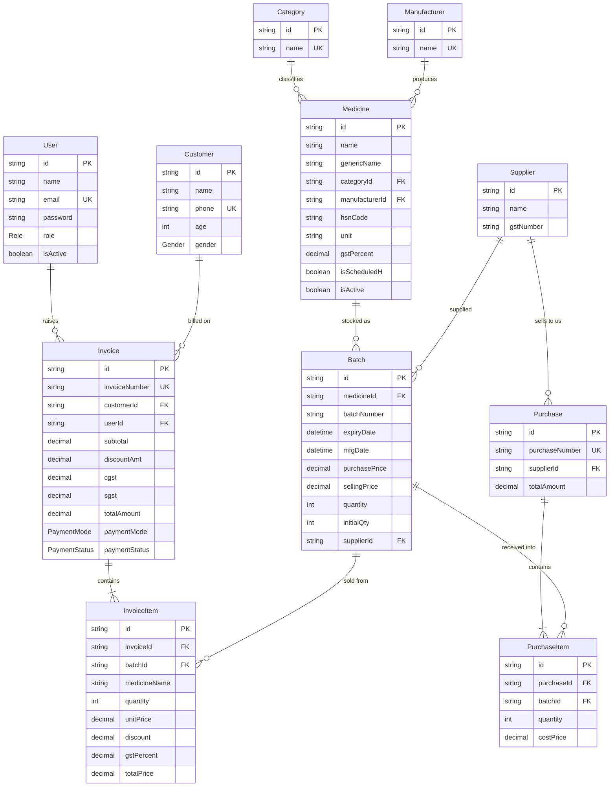

# Data Model

Source of truth: [`backend/prisma/schema.prisma`](../backend/prisma/schema.prisma) · PostgreSQL 15 · Prisma 5.10

All primary keys are **CUID strings** (`@default(cuid())`), not integers — IDs are opaque and safe to expose.

---

## 1. Entity-relationship diagram



**Reading the cardinalities:** an `Invoice` must have at least one `InvoiceItem` in practice (the validator requires it) though the database does not enforce it. `Invoice.customerId` is nullable — walk-in sales carry no customer. Everything else marked FK is mandatory.

---

## 2. Enumerations

| Enum              | Values                                  | Default        | Used by                   |
| ----------------- | --------------------------------------- | -------------- | ------------------------- |
| `Role`          | `ADMIN`, `PHARMACIST`, `CASHIER`  | `CASHIER`    | `User.role`             |
| `Gender`        | `MALE`, `FEMALE`, `OTHER`         | *(nullable)* | `Customer.gender`       |
| `PaymentMode`   | `CASH`, `UPI`, `CARD`, `CREDIT` | `CASH`       | `Invoice.paymentMode`   |
| `PaymentStatus` | `PAID`, `PENDING`, `PARTIAL`      | `PAID`       | `Invoice.paymentStatus` |

---

## 3. Table reference

### 3.1 `User`

| Column                        | Type     | Constraints                | Notes                                                                      |
| ----------------------------- | -------- | -------------------------- | -------------------------------------------------------------------------- |
| `id`                        | String   | PK, cuid                   |                                                                            |
| `name`                      | String   | required                   |                                                                            |
| `email`                     | String   | **unique**, required | Login identity; duplicates surface as`409`                               |
| `password`                  | String   | required                   | bcrypt hash, cost 12. Never selected into responses                        |
| `role`                      | Role     | default`CASHIER`         |                                                                            |
| `isActive`                  | Boolean  | default`true`            | `false` blocks login *and* invalidates existing tokens on next request |
| `createdAt` / `updatedAt` | DateTime | auto                       |                                                                            |

Relations: `invoices Invoice[]`.

> Every user query in the codebase uses an explicit `select` that omits `password` — except the two places that need the hash to compare it (`login`, `changePassword`). Preserve that discipline when adding queries.

### 3.2 `Category`

| Column   | Type   | Constraints                         |
| -------- | ------ | ----------------------------------- |
| `id`   | String | PK, cuid                            |
| `name` | String | **unique**, min 2 chars (Zod) |

Relations: `medicines Medicine[]`. Hard delete — fails with an FK error if any medicine references it.

### 3.3 `Manufacturer`

Identical shape to `Category`: `id`, unique `name`, `medicines Medicine[]`. Hard delete.

### 3.4 `Medicine`

| Column                        | Type         | Constraints        | Notes                                                                                                                          |
| ----------------------------- | ------------ | ------------------ | ------------------------------------------------------------------------------------------------------------------------------ |
| `id`                        | String       | PK, cuid           |                                                                                                                                |
| `name`                      | String       | required, min 2    | Brand name                                                                                                                     |
| `genericName`               | String?      | optional           | Salt / molecule; searchable                                                                                                    |
| `categoryId`                | String       | FK → Category     |                                                                                                                                |
| `manufacturerId`            | String       | FK → Manufacturer |                                                                                                                                |
| `hsnCode`                   | String?      | optional           | HSN for GST classification; searchable                                                                                         |
| `unit`                      | String       | required           | Constrained by Zod to: tablet, capsule, syrup, injection, cream, drops, powder, inhaler, other —**not** by the database |
| `gstPercent`                | Decimal(5,2) | default`12`      | Zod restricts to 0 / 5 / 12 / 18                                                                                               |
| `isScheduledH`              | Boolean      | default`false`   | Prescription-only flag; displayed at POS, not enforced                                                                         |
| `isActive`                  | Boolean      | default`true`    | Soft-delete flag; list and search filter on it                                                                                 |
| `createdAt` / `updatedAt` | DateTime     | auto               |                                                                                                                                |

Relations: `category`, `manufacturer`, `batches Batch[]`.

**No unique constraint on `name`.** Two medicines with the same brand name from different manufacturers are legal — and intended.

**Derived fields** returned by `GET /api/inventory/medicines` but *not stored*:

- `totalStock` — true stock across every in-stock batch, from a separate `groupBy` ([G-10](./08-gap-analysis.md#g-10)).
- `nearestExpiry` — expiry of that batch.
- `sellingPrice` — selling price of that batch, `0` when no stock exists.

### 3.5 `Batch` — the stock unit

| Column            | Type          | Constraints                          | Notes                                                                                                             |
| ----------------- | ------------- | ------------------------------------ | ----------------------------------------------------------------------------------------------------------------- |
| `id`            | String        | PK, cuid                             |                                                                                                                   |
| `medicineId`    | String        | FK → Medicine                       |                                                                                                                   |
| `batchNumber`   | String        | required                             | Printed on the manufacturer's pack                                                                                |
| `expiryDate`    | DateTime      | required                             | Drives FEFO ordering and alerts                                                                                   |
| `mfgDate`       | DateTime?     | optional, must precede`expiryDate` | Added by migration`20260419152932_add_mfgdate`; recordable since 2026-08-19 — [G-04](./08-gap-analysis.md#g-04) |
| `purchasePrice` | Decimal(12,2) | > 0                                  | Cost. Never exposed at POS                                                                                        |
| `sellingPrice`  | Decimal(12,2) | > 0                                  | Pre-GST price used as the POS unit price                                                                          |
| `quantity`      | Int           | > 0 at creation                      | **Live stock.** Decremented per sale                                                                        |
| `initialQty`    | Int           | set =`quantity` at creation        | Opening stock, for depletion analysis                                                                             |
| `supplierId`    | String        | FK → Supplier                       |                                                                                                                   |
| `createdAt`     | DateTime      | auto                                 |                                                                                                                   |

**Unique:** `@@unique([medicineId, batchNumber])` — the same batch number can recur across different medicines, never within one.

Relations: `medicine`, `supplier`, `invoiceItems`, `purchaseItems`.

> `quantity` has **no non-negative constraint**. Since 2026-08-18 the decrement is a conditional `updateMany` inside the invoice transaction, so a concurrent sale can no longer drive it negative ([G-09](./08-gap-analysis.md#g-09)). A `CHECK (quantity >= 0)` constraint remains worth adding as a database-level backstop against any future write path.

### 3.6 `Supplier`

| Column          | Type     | Constraints                           |
| --------------- | -------- | ------------------------------------- |
| `id`          | String   | PK, cuid                              |
| `name`        | String   | required, min 2                       |
| `contactName` | String?  | optional                              |
| `phone`       | String?  | optional                              |
| `email`       | String?  | optional, email format when non-empty |
| `gstNumber`   | String?  | optional — supplier GSTIN            |
| `address`     | String?  | optional                              |
| `createdAt`   | DateTime | auto                                  |

Relations: `batches Batch[]`, `purchases Purchase[]`. Hard delete; fails with an FK error once any batch references the supplier.

### 3.7 `Customer`

| Column        | Type     | Constraints                   | Notes                                  |
| ------------- | -------- | ----------------------------- | -------------------------------------- |
| `id`        | String   | PK, cuid                      |                                        |
| `name`      | String   | required, min 2               |                                        |
| `phone`     | String?  | **unique** when present | The de facto lookup key at the counter |
| `email`     | String?  | optional                      |                                        |
| `address`   | String?  | optional                      |                                        |
| `age`       | Int?     | 0–150 (Zod)                  |                                        |
| `gender`    | Gender?  | optional                      |                                        |
| `createdAt` | DateTime | auto                          |                                        |

Relations: `invoices Invoice[]`. **No `updatedAt`, no soft delete, no delete route.**

### 3.8 `Invoice`

| Column            | Type          | Constraints              | Notes                                                                         |
| ----------------- | ------------- | ------------------------ | ----------------------------------------------------------------------------- |
| `id`            | String        | PK, cuid                 |                                                                               |
| `invoiceNumber` | String        | **unique**         | `INVyymmdd-nnnn`                                                            |
| `customerId`    | String?       | FK → Customer, nullable | Null = walk-in                                                                |
| `userId`        | String        | FK → User               | Operator who raised it                                                        |
| `date`          | DateTime      | default now              | Business date used by every report filter                                     |
| `subtotal`      | Decimal(12,2) |                          | Σ of**rounded** line taxable values (after line discounts, before tax) |
| `discountAmt`   | Decimal(12,2) | default 0                | Bill-level flat discount, applied post-tax                                    |
| `cgst`          | Decimal(12,2) | default 0                | Σ rounded line CGST                                                          |
| `sgst`          | Decimal(12,2) | default 0                | Σ rounded line SGST                                                          |
| `totalAmount`   | Decimal(12,2) |                          | `subtotal + cgst + sgst − discountAmt`, exactly                            |
| `paymentMode`   | PaymentMode   | default`CASH`          |                                                                               |
| `paymentStatus` | PaymentStatus | default`PAID`          | Only`PAID` invoices enter the GST report                                    |
| `notes`         | String?       | optional                 |                                                                               |
| `createdAt`     | DateTime      | auto                     | Distinct from`date`; invoice numbering counts on `createdAt`              |

Relations: `customer?`, `user`, `items InvoiceItem[]`.

> `date` and `createdAt` both default to now and never diverge today, but reports filter on `date` while `generateInvoiceNumber()` counts on `createdAt`. If back-dated invoices are ever allowed, these will disagree.

### 3.9 `InvoiceItem`

| Column           | Type          | Notes                                                                                           |
| ---------------- | ------------- | ----------------------------------------------------------------------------------------------- |
| `id`           | String        | PK, cuid                                                                                        |
| `invoiceId`    | String        | FK → Invoice                                                                                   |
| `batchId`      | String        | FK → Batch — ties the sale to the exact physical stock, which is what makes recalls traceable |
| `medicineName` | String        | **Snapshot** at time of sale                                                              |
| `quantity`     | Int           | Units sold                                                                                      |
| `unitPrice`    | Decimal(12,2) | Snapshot of batch selling price                                                                 |
| `discount`     | Decimal(5,2)  | Line discount**percentage**, default 0                                                    |
| `gstPercent`   | Decimal(5,2)  | Snapshot of the medicine's rate                                                                 |
| `totalPrice`   | Decimal(12,2) | `taxable + cgst + sgst`, built from the rounded parts                                         |

Not stored, recomputable: line taxable value, line CGST, line SGST.

### 3.10 `InvoiceCounter` — invoice serial allocation

| Column  | Type   | Constraints | Notes                                          |
| ------- | ------ | ----------- | ---------------------------------------------- |
| `day` | String | PK          | `yymmdd`, matching the invoice-number prefix |
| `seq` | Int    | required    | Last serial handed out for that day            |

One row per business day. `generateInvoiceNumber()` runs a single `INSERT … ON CONFLICT ("day") DO UPDATE SET seq = seq + 1 RETURNING seq` **inside the invoice transaction**, so concurrent checkouts queue on the row lock and each receives a distinct serial. Because the increment shares the invoice's transaction, a rolled-back sale returns its number — serials stay gapless, which matters for a tax document.

When the row is first created for a day it seeds itself from the invoices already recorded that day, so days written before this table existed continue where they left off rather than colliding.

This is the only raw SQL in the codebase; the atomicity guarantee is the reason.

### 3.11 `Purchase` / `PurchaseItem` — 🟡 modelled, unreachable

| `Purchase`             | Type          | Notes                  |
| ------------------------ | ------------- | ---------------------- |
| `id`                   | String        | PK                     |
| `purchaseNumber`       | String        | unique,`POyymm-nnnn` |
| `supplierId`           | String        | FK → Supplier         |
| `date` / `createdAt` | DateTime      |                        |
| `totalAmount`          | Decimal(12,2) |                        |
| `notes`                | String?       |                        |

| `PurchaseItem` | Type           |
| ---------------- | -------------- |
| `id`           | String PK      |
| `purchaseId`   | FK → Purchase |
| `batchId`      | FK → Batch    |
| `quantity`     | Int            |
| `costPrice`    | Decimal(12,2)  |

No route, controller, validator or UI touches these tables. `generatePurchaseNumber()` in `invoice.utils.js` is written but never called. `GET /api/inventory/suppliers/:id` includes a `purchases` array that is always empty. Decision needed — see [PRD Q7](./01-product-requirements.md#14-open-questions).

---

## 4. Indexes and constraints

### Present

| Type             | Where                                                                                                                                |
| ---------------- | ------------------------------------------------------------------------------------------------------------------------------------ |
| Primary key      | Every table (`id`)                                                                                                                 |
| Unique           | `User.email`, `Category.name`, `Manufacturer.name`, `Customer.phone`, `Invoice.invoiceNumber`, `Purchase.purchaseNumber` |
| Composite unique | `Batch(medicineId, batchNumber)`                                                                                                   |
| Foreign keys     | All relations above; Postgres auto-indexes the referenced side only                                                                  |

### Added 2026-08-20

| Suggested index                                   | Serves                            | Why it matters                                                                                                                                                                          |
| ------------------------------------------------- | --------------------------------- | --------------------------------------------------------------------------------------------------------------------------------------------------------------------------------------- |
| `Batch(expiryDate)`                             | expiry alerts, FEFO ordering      | Hit on every dashboard load and every POS search                                                                                                                                        |
| `Batch(quantity)`                               | low-stock report                  | Full scan today                                                                                                                                                                         |
| `Batch(medicineId)`                             | POS search join                   | Prisma does not create FK-side indexes automatically                                                                                                                                    |
| `Invoice(date)`                                 | every report and the invoice list | The hottest filter in the reporting layer                                                                                                                                               |
| `Invoice(customerId)`                           | customer history                  |                                                                                                                                                                                         |
| `InvoiceItem(invoiceId)`                        | invoice detail/print              |                                                                                                                                                                                         |
| GIN`pg_trgm` on `Medicine(name, genericName)` | POS search                        | `ILIKE '%q%'` cannot use a b-tree index                                                                                                                                               |
| ~~`CHECK (Batch.quantity >= 0)`~~              | integrity                         | **Added 2026-08-20** (`Batch_quantity_non_negative`). Hand-written in migration `20260820052324_add_batch_quantity_check` — Prisma cannot express CHECK in `schema.prisma` |

---

## 5. Invariants

These must hold at all times. Any new write path must preserve them.

| #   | Invariant                                                       | Enforced by                                                                                                                                                                                                                                                                           |
| --- | --------------------------------------------------------------- | ------------------------------------------------------------------------------------------------------------------------------------------------------------------------------------------------------------------------------------------------------------------------------------- |
| I-1 | `Batch.quantity ≥ 0`                                         | **Enforced by the database** — `CHECK ("quantity" >= 0)`, constraint `Batch_quantity_non_negative`, added 2026-08-20. The conditional decrement inside the invoice transaction remains the mechanism; the constraint is the backstop for write paths that do not exist yet |
| I-2 | `Batch.quantity ≤ initialQty`                                | Nothing. Batch update can raise quantity arbitrarily                                                                                                                                                                                                                                  |
| I-3 | Every`InvoiceItem` points at a real `Batch`                 | FK                                                                                                                                                                                                                                                                                    |
| I-4 | `Invoice.totalAmount = subtotal + cgst + sgst − discountAmt` | Application (`billing.controller.js`)                                                                                                                                                                                                                                               |
| I-5 | `Invoice.cgst = Invoice.sgst`                                 | Application — the 50/50 split is unconditional                                                                                                                                                                                                                                       |
| I-6 | `invoiceNumber` is unique and gapless per day                 | DB unique constraint + the atomic`InvoiceCounter` upsert inside the invoice transaction                                                                                                                                                                                             |
| I-7 | Deactivating a user immediately denies access                   | `protect` reloads and checks `isActive`                                                                                                                                                                                                                                           |
| I-8 | Soft-deleted medicines never appear in list or search           | `where: { isActive: true }` in both queries                                                                                                                                                                                                                                         |
| I-9 | Sold-out batches never appear at POS                            | `where: { quantity: { gt: 0 } }` in search                                                                                                                                                                                                                                          |

---

## 6. Migration history

| Migration                              | Date       | Contents                                             |
| -------------------------------------- | ---------- | ---------------------------------------------------- |
| `20260418054922_init`                | 2026-04-18 | All 11 tables, 4 enums, all constraints              |
| `20260419152932_add_mfgdate`         | 2026-04-19 | Adds nullable`Batch.mfgDate`                       |
| `20260818171902_add_invoice_counter` | 2026-08-18 | Adds`InvoiceCounter` for race-free invoice serials |
| `20260819153025_money_to_decimal`    | 2026-08-19 | Money →`DECIMAL(12,2)`, rates → `DECIMAL(5,2)` |

Workflow:

```bash
npx prisma migrate dev --name <change>   # author + apply locally
npx prisma migrate deploy                # apply in CI/production
npx prisma generate                      # regenerate the client
npx prisma studio                        # browse data
```

The client is generated for `["native", "linux-musl-openssl-3.0.x"]` so the same generated client works on the host and inside Alpine-based images.

---

## 7. Seed data

`npm run seed` ([seed.js](../backend/src/utils/seed.js)) upserts a single admin:

```
email:    admin@medstore.com
password: admin123
role:     ADMIN
```

Idempotent (`upsert` on email). **Change this password immediately on any non-local deployment** — the credential is in the repository. No categories, manufacturers, medicines or suppliers are seeded, so a fresh database needs masters created before the first batch can be added.

---

## 8. Data lifecycle & retention

| Entity                  | Created by         | Updated by        | Deleted                              |
| ----------------------- | ------------------ | ----------------- | ------------------------------------ |
| User                    | Admin              | Admin / self      | Hard delete (not self)               |
| Category / Manufacturer | Admin, Pharmacist  | same              | Hard delete (FK-blocked when in use) |
| Medicine                | Admin, Pharmacist  | same              | **Soft** (`isActive=false`)  |
| Batch                   | Admin, Pharmacist  | same + every sale | Never                                |
| Supplier                | Admin, Pharmacist  | same              | Hard delete (FK-blocked when in use) |
| Customer                | Any user           | Any user          | Never — no route                    |
| Invoice / InvoiceItem   | Any user (on sale) | Never             | Never                                |

**Invoices are append-only.** There is no correction path in the system (FR-BILL-17), which is good for auditability and bad for daily operations — a mis-keyed bill can only be handled outside the system today.

**Retention.** No purge or archival exists. Customer records — name, phone, age, gender and full purchase history — are retained indefinitely. Decide a retention period before any deployment handling real customers ([PRD Q6](./01-product-requirements.md#14-open-questions), [07 — Security §8](./07-security.md#8-privacy-considerations)).

---

## 9. Known modelling issues

| #      | Issue                                                                 | Impact                                                                                                                                                        | Detail                                                      |
| ------ | --------------------------------------------------------------------- | ------------------------------------------------------------------------------------------------------------------------------------------------------------- | ----------------------------------------------------------- |
| ~~1~~ | ~~Money stored as `Float`~~                                        | Fixed 2026-08-19 — now`DECIMAL(12,2)`. Historical rows keep the value they printed, so a pre-migration invoice can still be a paisa off its own components | [G-07](./08-gap-analysis.md#g-07)                            |
| ~~2~~ | ~~`mfgDate` unreachable~~                                          | Fixed 2026-08-19. Rows created before then still hold`null`                                                                                                 | [G-04](./08-gap-analysis.md#g-04)                            |
| 3      | `Purchase`/`PurchaseItem` unused                                  | Dead schema; misleading supplier response                                                                                                                     | [FR-PUR](./01-product-requirements.md#611-purchases--fr-pur) |
| 4      | No`updatedAt` on `Batch`, `Customer`, `Supplier`, `Invoice` | Cannot tell when a record last changed                                                                                                                        | —                                                          |
| 5      | No audit table                                                        | Price and stock edits are untraceable                                                                                                                         | NFR-17                                                      |
| 6      | `Medicine.unit` is a free string in the DB                          | Direct DB writes can bypass the Zod allowlist                                                                                                                 | Consider a Postgres enum                                    |
| ~~7~~ | ~~No `CHECK (quantity >= 0)`~~                                     | Fixed 2026-08-20 — the database now rejects a negative quantity on any write path, not just the guarded decrement                                            | I-1                                                         |
| ~~8~~ | ~~`totalStock` computed from one batch~~                           | Fixed 2026-08-19 — summed with a`groupBy`                                                                                                                  | [G-10](./08-gap-analysis.md#g-10)                            |
