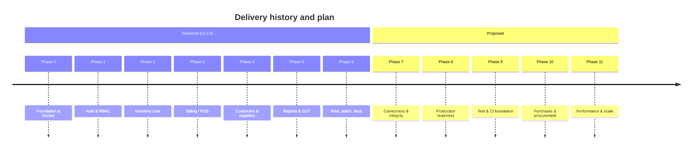
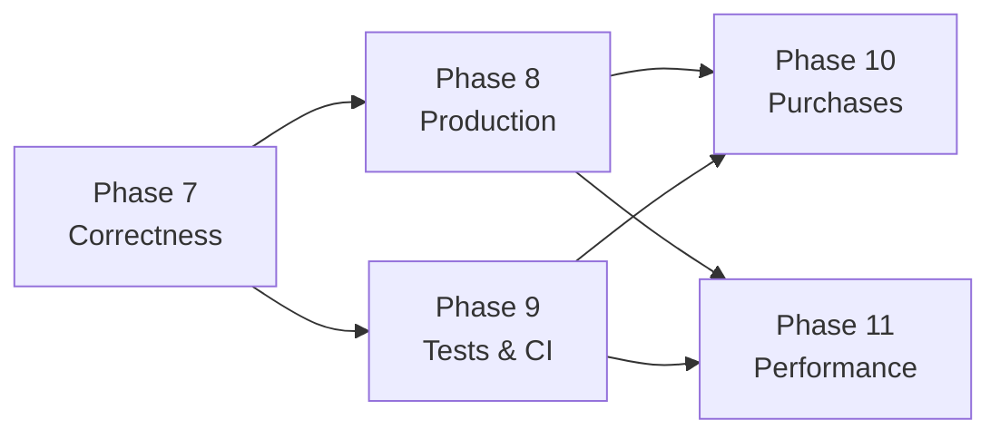

# 05 — Roadmap & Phases

**As of:** 2026-08-17 · **Shipped:** v1.0.0 on 2026-04-28

Phases 0–6 are **history** — reconstructed from the code, migrations and commit record. Phases 7+ are **proposals**, sequenced by dependency and risk. Nothing in phases 7+ exists in the codebase.

---

## Where the project stands

**Health snapshot**

| Dimension | State |
|---|---|
| Feature completeness for a single store | Strong — the full sell/stock/report loop works |
| Correctness under concurrency | **Weak** — invoice numbering and stock deduction both race |
| Production deployability | **Not ready** — dev-only images, no TLS, secrets in compose |
| Test coverage | **Zero** |
| Documentation accuracy | Fixed by this `docs/` set; component READMEs still drift |

The honest read: v1.0.0 is a complete, coherent product built fast, sitting on a handful of integrity and deployment gaps that must close before real money runs through it. Phase 7 is not optional.

---

## Delivered phases

### Phase 0 — Foundation & containerisation ✅

**Goal:** one command brings up a working stack.

- `docker-compose.yml` with five services, healthcheck-gated start order, `pgdata` volume.
- Dev Dockerfiles for frontend (Vite, `--host 0.0.0.0`) and backend (nodemon, openssl for Prisma).
- Nginx reverse proxy with WebSocket upgrade headers for HMR.
- Express bootstrap: helmet, compression, morgan, CORS allowlist, rate limiter, `/health`.
- Prisma client singleton that exits on connection failure; Redis client that never crashes the process.

**Exit criteria met:** `docker compose up` → `/health` returns 200.

### Phase 1 — Authentication & RBAC ✅

**Goal:** nobody touches data without an identity and a role.

- `User` model with `Role` enum and `isActive`; migration `20260418054922_init`.
- bcrypt (cost 12) hashing; JWT issuance with 7-day expiry.
- `protect` middleware reloading the user per request; `authorize(...roles)` for RBAC.
- Login, register (admin-only), `me`, change-password.
- Admin user CRUD + own-profile update.
- Frontend: Login page, Zustand persisted auth store, `ProtectedRoute`, axios interceptors (attach token, hard-redirect on 401), role-filtered sidebar.
- Seed script creating the bootstrap admin.

**Exit criteria met:** a cashier is denied every admin route server-side.

### Phase 2 — Inventory core ✅

**Goal:** model pharmacy stock the way a pharmacy actually holds it.

- `Category`, `Manufacturer`, `Medicine`, `Batch`, `Supplier` models.
- Zod validators constraining unit and GST rate.
- Medicine CRUD with soft delete, pagination, search across name/generic/HSN.
- Batch creation with `initialQty` capture and per-medicine unique batch numbers.
- Expiry and low-stock query endpoints.
- Supplier CRUD.
- Frontend Inventory page with four tabs.
- Migration `20260419152932_add_mfgdate`.

**Known debt from this phase:** all cleared 2026-08-19 — ~~`mfgDate` never reaches the database~~ ([G-04](./08-gap-analysis.md#g-04)), ~~batch update has no validation~~ ([G-05](./08-gap-analysis.md#g-05)), ~~`totalStock` is computed from one batch~~ ([G-10](./08-gap-analysis.md#g-10)).

### Phase 3 — Billing / POS ✅

**Goal:** a correct invoice in under a minute.

- `Invoice` + `InvoiceItem` with payment mode/status enums.
- Server-side GST engine: per-line discount → taxable → GST → 50/50 CGST/SGST split.
- Pre-write stock verification with per-medicine error messages.
- Atomic invoice creation + stock decrement via `$transaction`.
- `INVyymmdd-nnnn` invoice numbering.
- Fast POS search returning the FEFO batch inline.
- Frontend Billing page: debounced search, cart with per-line discount, live totals, payment selection, print.

**Known debt:** ~~numbering collision and the stock-check race~~ — both fixed 2026-08-18 ([G-01](./08-gap-analysis.md#g-01), [G-09](./08-gap-analysis.md#g-09)); no void/edit path (FR-BILL-17).

### Phase 4 — Customers & suppliers ✅

- `Customer` model with unique phone, age/gender demographics.
- Customer list with search and invoice counts; detail with recent invoice history.
- Inline customer registration from the POS.
- Standalone Suppliers page alongside the Inventory tab.

**Known debt:** no customer delete; `Customer` has no `updatedAt`.

### Phase 5 — Reports & GST ✅

- Daily summary aggregation with payment-mode breakdown.
- Monthly GST report restricted to `PAID` invoices, with period totals.
- Expiry and low-stock reports with configurable horizon/threshold.
- Dashboard with six parallel metric calls.
- Reports page with four tabs; Recharts visualisations.
- Notification tray polling expiry + low stock every 5 minutes.

**Known debt:** the trend chart makes seven requests ([G-08](./08-gap-analysis.md#g-08)); no CSV export; GST report parameters unvalidated.

### Phase 6 — Print, polish & documentation ✅

- Auto-print after invoice creation; reprint from history.
- 20 shadcn/ui primitives; skeleton loaders; Sonner toasts throughout.
- Sidebar collapse, topbar alerts and user menu.
- Settings page: profile, password, user management.
- README set and `CHANGELOG.md` for 1.0.0.

**Known debt:** the READMEs describe endpoints that were never built — the reason this `docs/` set exists ([08 — Gap Analysis](./08-gap-analysis.md)).

---

## Proposed phases

### Phase 7 — Correctness & data integrity 🔴

**Why first:** every item here can silently corrupt financial or stock data in normal operation. No new feature is worth building on top of this.

| # | Work | Ref |
|---|---|---|
| ~~7.1~~ ✅ | Move stock verification **inside** the transaction; use a conditional update (`updateMany where quantity >= qty`) and abort when zero rows change — **done 2026-08-18** | [G-09](./08-gap-analysis.md#g-09) |
| ~~7.2~~ ✅ | Replace count-based invoice numbering — **done 2026-08-18** via an atomic per-day `InvoiceCounter` upsert (retry alone proved insufficient) | [G-01](./08-gap-analysis.md#g-01) |
| ~~7.3~~ ✅ | Migrate all money columns from `Float` to `Decimal(12,2)` — **done 2026-08-19**, with `Prisma.Decimal` arithmetic and a `json replacer` keeping the API on numbers | [G-07](./08-gap-analysis.md#g-07) |
| ~~7.4~~ ✅ | Add `mfgDate` to `batchSchema` and to the batch form — **done 2026-08-19**, with a mfg-before-expiry rule | [G-04](./08-gap-analysis.md#g-04) |
| ~~7.5~~ ✅ | Add a Zod schema to `PUT /api/inventory/batches/:id` — **done 2026-08-19**, strict and excluding `quantity` | [G-05](./08-gap-analysis.md#g-05) |
| ~~7.6~~ ✅ | Fix `totalStock` to aggregate across all batches — **done 2026-08-19** | [G-10](./08-gap-analysis.md#g-10) |
| ~~7.7~~ ✅ | Add validation to `POST /api/auth/register`, `POST /api/users`, `PUT /api/users/:id` — **done 2026-08-19**, plus profile and change-password | [G-11](./08-gap-analysis.md#g-11) |
| ~~7.8~~ ✅ | Map FK-violation `P2003` to a clean 409 for category/manufacturer/supplier delete — **done 2026-08-19** | [G-12](./08-gap-analysis.md#g-12) |
| 7.9 | Add `CHECK (quantity >= 0)` on `Batch` | [Data model I-1](./03-data-model.md#5-invariants) |
| 7.10 | Delete the four empty route files | [G-13](./08-gap-analysis.md#g-13) |

**Exit criteria:** two concurrent invoices for the same last unit produce exactly one success and one clean 400; 1,000 sequential invoices produce 1,000 distinct numbers; a GST report over 10,000 invoices reconciles to the cent.

**Estimate:** 1 sprint. 7.3 carries a data migration and should ship first, alone.

### Phase 8 — Production readiness 🔴

**Why:** there is currently no safe way to run this outside a laptop.

| # | Work |
|---|---|
| 8.1 | Multi-stage production Dockerfiles; `vite build` output served as static files by Nginx |
| 8.2 | Production `docker-compose.prod.yml`: no bind mounts, no dev dependencies, restart policies |
| 8.3 | TLS termination in Nginx + HSTS; redirect 80 → 443 |
| 8.4 | Stop exposing Postgres and Redis on host ports |
| 8.5 | Secrets from a store/`.env` file excluded from the image; remove the hard-coded DB password from compose |
| ~~8.6~~ ✅ | `trust proxy` so rate limiting and logs see real client IPs — **done 2026-08-19** (pulled forward from Phase 8), scoped to private-range peers ([G-06](./08-gap-analysis.md#g-06)) |
| ~~8.7~~ ✅ | Route the SPA through `/api` and drop cross-origin entirely — **done 2026-08-19** (pulled forward from Phase 8), with a Vite dev-server proxy so `:5173` stays same-origin too ([G-02](./08-gap-analysis.md#g-02)) |
| 8.8 | Structured JSON logging with request IDs; replace `morgan("dev")` |
| 8.9 | Real health/readiness probes that check Postgres and Redis |
| 8.10 | Documented `pg_dump` backup + restore procedure, and a rehearsed restore |
| 8.11 | Force a password change for the seeded admin on first login |

**Exit criteria:** a clean host runs the stack over HTTPS with no default credentials and a tested restore.

### Phase 9 — Test & CI foundation 🟢 *(mostly delivered 2026-08-19)*

**Why:** phases 7 and 8 change financial logic. Without tests, the fixes are unverifiable.

| # | Work |
|---|---|
| ~~9.1~~ ✅ | Vitest + Supertest on the backend, against a disposable `_test` database the harness refuses to run without |
| ~~9.2~~ ✅ | GST engine — all seven fixtures plus the reconciliation invariants |
| ~~9.3~~ ✅ | Integration tests per router: auth, the full RBAC matrix, validation boundaries, Prisma error mapping |
| ~~9.4~~ ✅ | Concurrency tests for stock deduction and invoice numbering |
| 9.5 | Vitest + Testing Library on the frontend for cart maths and auth guards — **still open** |
| 9.6 | Playwright smoke: login → search → cart → invoice → verify stock — **still open** |
| ~~9.7~~ ✅ | GitHub Actions: backend tests against a Postgres service, frontend lint and typecheck |
| ~~9.8~~ ✅ | Coverage gate at 90% on `billing.controller.js` and `auth.middleware.js` |

**Exit criteria:** CI green on every PR; the Phase 7 concurrency fixes are proven by failing-then-passing tests.

### Phase 10 — Purchases & procurement 🟡

**Why:** the schema is already there and half-referenced by the supplier endpoint. Either build it or delete it.

| # | Work |
|---|---|
| 10.1 | `purchase.controller.js` + routes; wire up `generatePurchaseNumber()` |
| 10.2 | Goods receipt: a purchase line creates or tops up a `Batch` in one transaction |
| 10.3 | Purchases UI under Inventory; supplier detail shows real purchase history |
| 10.4 | Supplier payables: purchase totals vs payments |
| 10.5 | Purchase vs sales margin report (`purchasePrice` vs `sellingPrice`) — FR-RPT-08 |

**Exit criteria:** stock enters the system only through a recorded purchase, and `GET /api/inventory/suppliers/:id` returns real history.

### Phase 11 — Performance & scale 🟢

| # | Work | Trigger |
|---|---|---|
| 11.1 | Redis cache for the per-request user lookup in `protect`, invalidated on user write | Immediate — highest-frequency query |
| 11.2 | Cache category/manufacturer lists | Low churn, read often |
| 11.3 | `pg_trgm` GIN index on medicine name/generic | > ~10k medicines |
| 11.4 | Add the indexes listed in [03 §4](./03-data-model.md#4-indexes-and-constraints) | Before invoice volume reaches ~100k |
| 11.5 | Server-side `/api/billing/invoices/trend?days=7` replacing 7 client calls | Now — cheap win |
| 11.6 | Single `/api/dashboard/stats` endpoint replacing the 6-call fan-out | Now |
| 11.7 | Paginate batches, suppliers and users | > ~500 rows |
| 11.8 | Frontend route-level code splitting (`Inventory.tsx` alone is 1,557 lines) | Bundle budget |

### Backlog — candidate features (unsequenced)

| Item | Requirement | Notes |
|---|---|---|
| Void / credit-note for invoices | FR-BILL-17 | Needs a policy decision on stock restoration ([Q3](./01-product-requirements.md#14-open-questions)) |
| Server-side PDF invoices | FR-BILL-18 | Puppeteer or pdfkit; enables emailing bills |
| Manual batch selection at POS | FR-BILL-19 | Overrides FEFO when the operator needs a specific pack |
| Block sale of expired batches | FR-BATCH-09 | Small change, real safety value |
| Prescription capture for Schedule H | FR-MED-12 | Compliance-driven; depends on [Q4](./01-product-requirements.md#14-open-questions) |
| CSV/Excel export on all reports | FR-RPT-09 | Most-requested reporting gap |
| Audit log for stock and price changes | NFR-17 | Prisma middleware can capture this centrally |
| Password reset by email | FR-AUTH-11 | Requires an SMTP dependency the stack does not have |
| Server-side logout / token revocation | FR-AUTH-09 | Needs a Redis denylist — pairs with 11.1 |
| Shared API types between client and server | NFR-22 | Zod schemas → inferred TS types in a shared package |
| IGST / inter-state supply | [Q2](./01-product-requirements.md#14-open-questions) | Schema change; only if the store ships out of state |
| Multi-store | Non-goal for 1.x | Would restructure every stock query |

---

## Release plan

Semantic versioning, per `CHANGELOG.md`.

| Version | Contents | Gate |
|---|---|---|
| 1.0.0 | Shipped 2026-04-28 | — |
| **1.1.0** | Phase 7 | Concurrency and money-precision proofs pass |
| **1.2.0** | Phase 8 | HTTPS, no default credentials, rehearsed restore |
| **1.3.0** | Phase 9 | CI green, critical-path coverage |
| **1.4.0** | Phase 10 | Purchase → batch flow live |
| **2.0.0** | Phase 11 + breaking API cleanups | Any route re-grouping (e.g. moving customers out of `/api/billing`) is a major version |

> Moving customers to `/api/customers`, suppliers to `/api/suppliers` and medicines to `/api/medicines` would make the API match every reader's expectation — but it breaks clients. Bundle it into 2.0.0 rather than dribbling it out.

## Sequencing rationale

Correctness precedes deployment: shipping a known oversell race to production converts a bug into lost inventory. Tests precede new features: Phase 10 writes to the same batch rows Phase 7 just fixed. Performance work comes last because nothing here is currently slow — it is currently *wrong*, which is a different problem.
