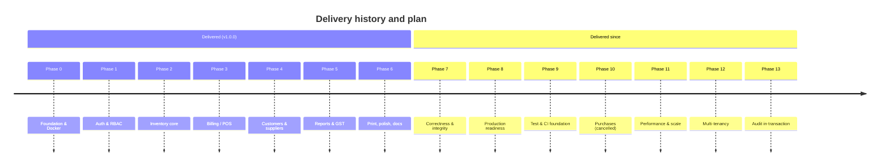
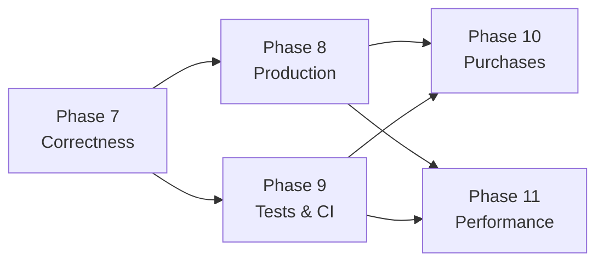

# Roadmap & Phases

**As of:** 2026-08-17 · **Shipped:** v1.0.0 on 2026-04-28

Phases 0–6 are **history** — reconstructed from the code, migrations and commit record. Phases 7+ are **proposals**, sequenced by dependency and risk. Nothing in phases 7+ exists in the codebase.

---

## Where the project stands

**Health snapshot**

| Dimension                               | State                                                                                                                                                                                                                                                     |
| --------------------------------------- | --------------------------------------------------------------------------------------------------------------------------------------------------------------------------------------------------------------------------------------------------------- |
| Feature completeness for a single store | Strong — the full sell/stock/report loop works                                                                                                                                                                                                           |
| Correctness under concurrency           | **Sound** — both races fixed and proven by concurrent tests; stock also has a database `CHECK` backstop. The last structural limit went on 2026-08-31: audited writes inside a transaction no longer need a second connection, so the void path's ceiling of five is gone and its test now runs twelve (Phase 13) |
| Production deployability                | **Ready to trial** — multi-stage images, TLS with HSTS and a CSP, no credential literals, data ports unpublished, structured logging, a readiness probe and a rehearsed restore. A real certificate and a retention decision remain the operator's |
| Test coverage                           | **634 backend tests across 24 files (91.8% statements, measured 2026-08-31)** with 90% gates on the invoice, auth and dashboard paths and 100% on the shared trend query, plus **144 frontend unit tests across 18 files** and a 7-flow browser smoke — all three on CI, all measured the same day. `medicine.controller.js` at 74.5% is the largest remaining gap |
| Documentation accuracy                  | This`docs/` set is the reference; the component READMEs were trimmed to point at it on 2026-08-20                                                                                                                                                       |

The honest read as of **2026-08-20**: the correctness gaps that made v1.0.0 unsafe for real money are closed and tested. What remains between here and a deployment is Phase 8 — images, TLS, secrets and backups — not the arithmetic.

---

## Delivered phases

### Phase 0 — Foundation & containerisation ✅

**Goal:** one command brings up a working stack.

- `docker-compose.yml` with five services, healthcheck-gated start order, `pgdata` volume. *(Four today — Redis was removed in Phase 8, [G-03](./08-gap-analysis.md#g-03).)*
- Dev Dockerfiles for frontend (Vite, `--host 0.0.0.0`) and backend (nodemon, openssl for Prisma).
- Nginx reverse proxy with WebSocket upgrade headers for HMR.
- Express bootstrap: helmet, compression, morgan, CORS allowlist, rate limiter, `/health`. *(morgan was replaced by pino in Phase 8.8.)*
- Prisma client singleton that exits on connection failure; Redis client that never crashes the process *(the Redis half was removed in Phase 8 — it never acquired a consumer)*.

**Exit criteria met:** `docker compose up` → `/health` returns 200.

### Phase 1 — Authentication & RBAC ✅

**Goal:** nobody touches data without an identity and a role.

- `User` model with `Role` enum and `isActive`; migration `20260418054922_init`.
- bcrypt (cost 12) hashing; JWT issuance with 7-day expiry.
- `protect` middleware reloading the user per request; `authorize(...roles)` for RBAC.
- Login, register (admin-only), `me`, change-password.
- Admin user CRUD + own-profile update.
- Frontend: Login page, Zustand persisted auth store, `ProtectedRoute`, axios interceptors (attach token, hard-redirect on 401), role-filtered sidebar.
- Seed script creating the bootstrap admin.

**Exit criteria met:** a cashier is denied every admin route server-side.

### Phase 2 — Inventory core ✅

**Goal:** model pharmacy stock the way a pharmacy actually holds it.

- `Category`, `Manufacturer`, `Medicine`, `Batch`, `Supplier` models.
- Zod validators constraining unit and GST rate.
- Medicine CRUD with soft delete, pagination, search across name/generic/HSN.
- Batch creation with `initialQty` capture and per-medicine unique batch numbers.
- Expiry and low-stock query endpoints.
- Supplier CRUD.
- Frontend Inventory page with four tabs.
- Migration `20260419152932_add_mfgdate`.

**Known debt from this phase:** all cleared 2026-08-19 — ~~`mfgDate` never reaches the database~~ ([G-04](./08-gap-analysis.md#g-04)), ~~batch update has no validation~~ ([G-05](./08-gap-analysis.md#g-05)), ~~`totalStock` is computed from one batch~~ ([G-10](./08-gap-analysis.md#g-10)).

### Phase 3 — Billing / POS ✅

**Goal:** a correct invoice in under a minute.

- `Invoice` + `InvoiceItem` with payment mode/status enums.
- Server-side GST engine: per-line discount → taxable → GST → 50/50 CGST/SGST split.
- Pre-write stock verification with per-medicine error messages.
- Atomic invoice creation + stock decrement via `$transaction`.
- `INVyymmdd-nnnn` invoice numbering.
- Fast POS search returning the FEFO batch inline.
- Frontend Billing page: debounced search, cart with per-line discount, live totals, payment selection, print.

**Known debt:** ~~numbering collision and the stock-check race~~ — both fixed 2026-08-18 ([G-01](./08-gap-analysis.md#g-01), [G-09](./08-gap-analysis.md#g-09)); ~~no void path~~ — voiding shipped 2026-08-20 ([G-15](./08-gap-analysis.md#g-15)). There is deliberately still no *edit*: a filed period must reconcile to what was filed, so a correction is a dated credit note rather than a rewrite. ~~Partial returns remain unsupported.~~ **Partial returns shipped 2026-08-24** (FR-BILL-17): returning 2 of 5 units no longer means voiding the sale and re-billing it, which would have changed the invoice number the customer is holding. A sale can now carry several credit notes, so the single-shot guarantee moved from a unique index on `reversesId` to a cumulative `InvoiceItem.returnedQty` applied with the same atomic check-and-apply as the stock decrement in [G-09](./08-gap-analysis.md#g-09).

### Phase 4 — Customers & suppliers ✅

- `Customer` model with unique phone, age/gender demographics.
- Customer list with search and invoice counts; detail with recent invoice history.
- Inline customer registration from the POS.
- Standalone Suppliers page alongside the Inventory tab.

**Known debt:** no customer delete; `Customer` has no `updatedAt`.

### Phase 5 — Reports & GST ✅

- Daily summary aggregation with payment-mode breakdown.
- Monthly GST report restricted to `PAID` invoices, with period totals.
- Expiry and low-stock reports with configurable horizon/threshold.
- Dashboard with six parallel metric calls.
- Reports page with four tabs; Recharts visualisations.
- Notification tray polling expiry + low stock every 5 minutes.

**Known debt:** the trend chart makes seven requests ([G-08](./08-gap-analysis.md#g-08)); no CSV export; GST report parameters unvalidated.

### Phase 6 — Print, polish & documentation ✅

- Auto-print after invoice creation; reprint from history.
- 20 shadcn/ui primitives; skeleton loaders; Sonner toasts throughout.
- Sidebar collapse, topbar alerts and user menu.
- Settings page: profile, password, user management.
- README set and `CHANGELOG.md` for 1.0.0.

**Known debt:** the READMEs describe endpoints that were never built — the reason this `docs/` set exists ([08 — Gap Analysis](./08-gap-analysis.md)).

---

## Proposed phases

### Phase 7 — Correctness & data integrity 🔴

**Why first:** every item here can silently corrupt financial or stock data in normal operation. No new feature is worth building on top of this.

| #            | Work                                                                                                                                                                                                                      | Ref                                              |
| ------------ | ------------------------------------------------------------------------------------------------------------------------------------------------------------------------------------------------------------------------- | ------------------------------------------------ |
| ~~7.1~~ ✅  | Move stock verification**inside** the transaction; use a conditional update (`updateMany where quantity >= qty`) and abort when zero rows change — **done 2026-08-18**                                     | [G-09](./08-gap-analysis.md#g-09)                 |
| ~~7.2~~ ✅  | Replace count-based invoice numbering —**done 2026-08-18** via an atomic per-day `InvoiceCounter` upsert (retry alone proved insufficient)                                                                       | [G-01](./08-gap-analysis.md#g-01)                 |
| ~~7.3~~ ✅  | Migrate all money columns from`Float` to `Decimal(12,2)` — **done 2026-08-19**, with `Prisma.Decimal` arithmetic and a `json replacer` keeping the API on numbers                                          | [G-07](./08-gap-analysis.md#g-07)                 |
| ~~7.4~~ ✅  | Add`mfgDate` to `batchSchema` and to the batch form — **done 2026-08-19**, with a mfg-before-expiry rule                                                                                                       | [G-04](./08-gap-analysis.md#g-04)                 |
| ~~7.5~~ ✅  | Add a Zod schema to`PUT /api/inventory/batches/:id` — **done 2026-08-19**, strict and excluding `quantity`                                                                                                     | [G-05](./08-gap-analysis.md#g-05)                 |
| ~~7.6~~ ✅  | Fix`totalStock` to aggregate across all batches — **done 2026-08-19**                                                                                                                                            | [G-10](./08-gap-analysis.md#g-10)                 |
| ~~7.7~~ ✅  | Add validation to`POST /api/auth/register`, `POST /api/users`, `PUT /api/users/:id` — **done 2026-08-19**, plus profile and change-password                                                                  | [G-11](./08-gap-analysis.md#g-11)                 |
| ~~7.8~~ ✅  | Map FK-violation`P2003` to a clean 409 for category/manufacturer/supplier delete — **done 2026-08-19**                                                                                                           | [G-12](./08-gap-analysis.md#g-12)                 |
| ~~7.9~~ ✅  | Add`CHECK (quantity >= 0)` on `Batch` — **done 2026-08-20**, hand-written migration (Prisma cannot express CHECK); verified rejecting a direct `UPDATE … = -1` while the concurrency suite passes unchanged | [Data model I-1](./03-data-model.md#5-invariants) |
| ~~7.10~~ ✅ | Delete the four empty route files —**done 2026-08-20**, along with the empty `frontend/nginx.conf` and the stray literal `frontend/@/` directory                                                               | [G-13](./08-gap-analysis.md#g-13)                 |

**Exit criteria:** two concurrent invoices for the same last unit produce exactly one success and one clean 400; 1,000 sequential invoices produce 1,000 distinct numbers; a GST report over 10,000 invoices reconciles to the cent.

**Estimate:** 1 sprint. 7.3 carries a data migration and should ship first, alone.

### Phase 8 — Production readiness ✅ *(delivered 2026-08-20)*

**Why:** there was no safe way to run this outside a laptop.

| #            | Work                                                                                                                                                                                                                                                                                           |
| ------------ | ---------------------------------------------------------------------------------------------------------------------------------------------------------------------------------------------------------------------------------------------------------------------------------------------- |
| ~~8.1~~ ✅  | Multi-stage production Dockerfiles —**done 2026-08-20**. The frontend image builds with Vite and serves the output from `nginx:alpine` (95 MB, no Node at runtime); the backend prunes dev dependencies but keeps the Prisma CLI so migrations are runnable in the deployed container |
| ~~8.2~~ ✅  | `docker-compose.prod.yml` — **done**. No bind mounts, restart policies, healthcheck-gated startup, and a data volume separate from the development stack's                                                                                                                            |
| ~~8.3~~ ✅  | TLS, HSTS, 80 → 443 —**done**, plus a CSP, `X-Frame-Options`, `Referrer-Policy`, `Permissions-Policy`, gzip and the `X-Forwarded-Proto` the dev config omits                                                                                                                   |
| ~~8.4~~ ✅  | **Done** — the production stack publishes only 80 and 443. Redis was removed rather than secured ([G-03](./08-gap-analysis.md#g-03))                                                                                                                                                     |
| ~~8.5~~ ✅  | **Done** — no credential literals in the production compose file, which fails fast with a named error if any is unset. `DATABASE_URL` is composed from the same variables Postgres uses, so the two cannot drift                                                                      |
| ~~8.6~~ ✅  | `trust proxy` so rate limiting and logs see real client IPs — **done 2026-08-19** (pulled forward from Phase 8), scoped to private-range peers ([G-06](./08-gap-analysis.md#g-06))                                                                                                     |
| ~~8.7~~ ✅  | Route the SPA through`/api` and drop cross-origin entirely — **done 2026-08-19** (pulled forward from Phase 8), with a Vite dev-server proxy so `:5173` stays same-origin too ([G-02](./08-gap-analysis.md#g-02))                                                                    |
| ~~8.8~~ ✅  | **Done** — pino. One JSON object per line in production, pretty in development, silent in tests. Every request carries a correlation id echoed as `X-Request-Id`, and credentials are redacted                                                                                        |
| ~~8.9~~ ✅  | **Done** — `/health` stays a cheap liveness check; `/health/ready` runs `SELECT 1` and answers 503 when the database is unreachable. Verified by stopping Postgres and watching it flip and recover                                                                               |
| ~~8.10~~ ✅ | **Done** — `scripts/backup.sh` and `scripts/restore.sh`. Rehearsed against the production stack: the entire schema was dropped, restored from a dump, every row count matched and the app authenticated again                                                                       |
| ~~8.11~~ ✅ | **Done** — enforced by the API, not the UI. A flagged account gets `403 PASSWORD_CHANGE_REQUIRED` on every route but reading its own profile and changing its password                                                                                                                |

**Exit criteria:** a clean host runs the stack over HTTPS with no default credentials and a tested restore. **Met 2026-08-20** — the browser smoke's six flows were re-run against the production images over TLS and all passed, the seeded admin cannot use the system until its password is replaced, and a full schema-loss restore was rehearsed.

### Phase 9 — Test & CI foundation 🟢 *(mostly delivered 2026-08-19)*

**Why:** phases 7 and 8 change financial logic. Without tests, the fixes are unverifiable.

| #           | Work                                                                                                                                                                                                                                                               |
| ----------- | ------------------------------------------------------------------------------------------------------------------------------------------------------------------------------------------------------------------------------------------------------------------ |
| ~~9.1~~ ✅ | Vitest + Supertest on the backend, against a disposable`_test` database the harness refuses to run without                                                                                                                                                       |
| ~~9.2~~ ✅ | GST engine — all seven fixtures plus the reconciliation invariants                                                                                                                                                                                                |
| ~~9.3~~ ✅ | Integration tests per router: auth, the full RBAC matrix, validation boundaries, Prisma error mapping                                                                                                                                                              |
| ~~9.4~~ ✅ | Concurrency tests for stock deduction and invoice numbering                                                                                                                                                                                                        |
| ~~9.5~~ ✅ | Vitest + Testing Library on the frontend —**done 2026-08-20**, 67 tests: cart maths against the §4 fixtures, the POS stock guards driven through the rendered page, ProtectedRoute, the sidebar role filter, the 401 interceptor and notification severity |
| ~~9.6~~ ✅ | Playwright smoke —**done 2026-08-20**, the six flows in docs/09 §5.7 against the real compose stack, ending with a cashier seeing no Settings link *and* receiving 403 from `/api/users`                                                               |
| ~~9.7~~ ✅ | GitHub Actions: backend tests against a Postgres service, frontend lint and typecheck                                                                                                                                                                              |
| ~~9.8~~ ✅ | Coverage gate at 90% on`billing.controller.js` and `auth.middleware.js`                                                                                                                                                                                        |

**Exit criteria:** CI green on every PR; the Phase 7 concurrency fixes are proven by failing-then-passing tests.

### Phase 10 — Purchases & procurement ❌ *(cancelled 2026-08-24)*

**The schema was deleted rather than built out** (PRD Q7, [G-13](./08-gap-analysis.md#g-13)). `Purchase` and `PurchaseItem` had existed since the initial migration with no controller, route, validator or UI, and `generatePurchaseNumber()` was written and never called.

The deciding argument: the traceability this phase looked like it would provide already exists. `Batch` carries `supplierId` and `purchasePrice`, and since 2026-08-22 the audit log records who created it — so stock already has a recorded cause and a cost. What Phase 10 would have added on top is purchase-level grouping of a delivery, supplier payables, and the margin report (FR-RPT-08): useful features, but nobody asked for them in the four months after 1.0.0, and a modelled-but-unbuilt table is not a head start. It is a thing that misleads every reader of the schema and makes an endpoint return an empty array that is not true.

What it would take to build it properly, recorded so a future decision starts from something:

| # | Work |
| ---- | ------------------------------------------------------------------------------------ |
| 10.1 | `Purchase` / `PurchaseItem` models and a migration, then a controller and routes |
| 10.2 | Goods receipt: a purchase line creates or tops up a `Batch` in one transaction |
| 10.3 | `generatePurchaseNumber()` on the `InvoiceCounter` pattern — the old count-based version was a read-then-write race, exactly the one [G-01](./08-gap-analysis.md#g-01) took two attempts to fix |
| 10.4 | Purchases UI under Inventory; real supplier history on `GET /suppliers/:id` |
| 10.5 | Supplier payables, and the purchase-vs-sales margin report (FR-RPT-08) |

**Exit criterion, if it is ever revived:** stock enters the system only through a recorded purchase.

### Phase 11 — Performance & scale ✅ *(delivered 2026-08-20, except 11.2)*

| #    | Work                                                                                 | Trigger                              |
| ---- | ------------------------------------------------------------------------------------ | ------------------------------------ |
| 11.1 | ~~Redis cache for the per-request user lookup~~ — **not applicable**: Redis was removed in Phase 8 as an unused dependency ([G-03](./08-gap-analysis.md#g-03)). Revisit only with measured evidence, and note it trades against the immediate-deactivation guarantee | — |
| 11.2 | Cache category/manufacturer lists                                                    | Low churn, read often                |
| ~~11.3~~ ✅ | `pg_trgm` GIN index on medicine name/generic — **done 2026-08-20**. Pre-emptive: it is used for selective terms, but at 10k medicines the planner still prefers a scan for a common one. 824 kB | > ~10k medicines |
| ~~11.4~~ ✅ | Add the indexes listed in [03 §4](./03-data-model.md#4-indexes-and-constraints) — **done 2026-08-20**. The schema had none at all; the invoice list went from a Seq Scan at cost 730 to an Index Scan at 36 | Before invoice volume reaches ~100k |
| ~~11.5~~ ✅ | Server-side `/api/billing/invoices/trend?days=7` — **done 2026-08-20**. 7 calls / 259 KB / 102 ms → 1 / <1 KB / 8 ms on 20k invoices, reproducing all seven daily summaries to the paisa ([G-08](./08-gap-analysis.md#g-08)) | Now — cheap win |
| ~~11.6~~ ✅ | Single `/api/dashboard/stats` — **done 2026-08-20**. Replaced **thirteen** requests, not six: the seven trend calls plus six panels, two of which fetched one row to read a count. 794 KB / 159 ms → 6 KB / 19 ms | Now |
| ~~11.7~~ ✅ | Paginate batches — **done 2026-08-20**: 25,022 rows / 8.4 MB / 1651 ms → 20 rows / 6.8 KB / 8 ms. Suppliers and users measured at 11 ms and 7 ms and were left alone; categories, manufacturers and suppliers also feed form dropdowns, where truncation would silently remove options | > ~500 rows |
| ~~11.8~~ ✅ | Frontend route-level code splitting — **done 2026-08-20**. Entry chunk 987 kB → 378 kB (287 → 122 kB gzip); Reports, the recharts-heavy page, is 81 kB loaded only when visited | Bundle budget |

### Phase 12 — Multi-tenancy ✅ *(delivered 2026-08-29)*

**This was a non-goal until the day it shipped.** The backlog line below said "multi-store — non-goal for 1.x — would restructure every stock query", and that estimate was right: `shopId` now appears in ten tables and in the `where` clause of every read and write across eleven controllers.

| # | Work |
| --- | ---- |
| 12.1 | `Shop` model and migration `20260828120000_add_shops_multi_tenant`: a `shopId` on User, Category, Manufacturer, Medicine, Batch, Customer, Supplier, Invoice, InvoiceCounter and AuditLog, each indexed |
| 12.2 | Re-keyed the constraints that were global and had to become per-shop — categories and manufacturers by name, customers by phone, invoices by serial, and the invoice counter's primary key |
| 12.3 | `shopId` as a JWT claim, so a caller's tenant comes from their token and never from the request |
| 12.4 | Every scoped write rewritten as `updateMany`/`deleteMany`, so `shopId` sits in the same `where` as `id` rather than in a check after the fact |
| 12.5 | `POST /api/auth/signup` reopened: it creates a shop and its first administrator, and no longer closes |
| 12.6 | `GET`/`PUT /api/shop` and a Settings tab — the business details the invoice header prints, replacing a hardcoded placeholder |

**What it cost.** Three things, all recorded rather than smoothed over:

- **Auditing broke for master data**, and stayed broken for a day. Moving edits onto `updateMany` took them out of the audit middleware's single-record path, so category renames, supplier retirements and user deactivations wrote no audit row at all. Fixed by auditing bulk writes on those models unconditionally.
- **Signup deadlocked the connection pool.** Shop and User are both audited, and the audit write goes on the outer client — so every in-flight signup needed a second connection while its own transaction held the first. Eight concurrent signups returned eight `500`s and created nothing. Fixed by replacing the interactive transaction with a nested write.
- ~~**The same hazard remains on the void path**, where `tx.batch.update` audits inside a transaction. Five concurrent voids is the measured ceiling.~~ **Fixed 2026-08-31**, and it turned out to be two defects rather than one — see Phase 13 below.

**Exit criteria met:** two shops created through the public signup share no row, and a foreign id answers 404 rather than 403 on every resource controller, the user list and the dashboard — asserted in `backend/tests/auth/signup.test.js`.

### Phase 13 — The audit trail joins its own transaction ✅ *(delivered 2026-08-31)*

The item Phase 12 left behind, and which this document called **the highest-value open work in the codebase**. It was.

`config/audit.js` ran as a Prisma middleware (`prisma.$use`). A middleware cannot see the transaction its caller is in, so its before/after reads and its `AuditLog` insert went out on the *global* client while the caller's transaction still held a pooled connection.

| # | Work |
| --- | ---- |
| 13.1 | The audit trail moved from `prisma.$use` to a Prisma **client extension** (`$extends`, `query.$allOperations`) |
| 13.2 | `config/db.js` wraps `$transaction` so its callback runs inside an `AsyncLocalStorage` holding the transaction client — an extension alone does not get one, so this is the half that actually closes it |
| 13.3 | The extension's reads and its insert go through that client when there is one, and through the unextended base client when there is not |
| 13.4 | `tests/billing/invoice-void.test.js` raised its concurrency cap from **4 to 12** |
| 13.5 | Three guards in `tests/audit/audit-log.test.js`: a rolled-back transaction leaves no audit row, a committed one still leaves a correct one, and `before` reflects the transaction's own earlier writes |

**Two defects, not one.** The concurrency ceiling was the known half. The other was never written down: because the insert committed on its own connection, **a rolled-back write left an audit row behind claiming it had happened** — a record of something that never occurred, which is worse than no record. A third, smaller one fell out with them: the `before` read could not see the transaction's uncommitted state, so a second edit to the same row in one transaction recorded the state from before the first.

**Measured, by disabling only the `$transaction` wrapper and re-running:** twelve concurrent partial returns produced **zero** successes, every one dying on pool exhaustion and the 5s transaction timeout. With it, twelve of twelve pass in about 300 ms. Both audit guards fail the same way, which is what makes them guards rather than assertions.

**One behaviour deliberately changed.** An audit insert that fails inside a transaction now propagates instead of being swallowed. The old swallow was right when the write was on its own connection; inside a transaction the failed statement has already aborted it at the database, so swallowing would only hide the cause and resurface it as an unrelated *"current transaction is aborted"* on the caller's next statement.

**What is unchanged, and why:** the array form `$transaction([...])` still writes its audit rows outside the transaction, because Prisma exposes no client for that form. It is used only for a handful of uncontended account writes.

**Exit criteria met:** 634 backend tests across 24 files pass; twelve concurrent returns succeed; a rolled-back transaction leaves no audit row.

### Backlog — candidate features (unsequenced)

| Item                                       | Requirement                                         | Notes                                                                                              |
| ------------------------------------------ | --------------------------------------------------- | -------------------------------------------------------------------------------------------------- |
| Void / credit-note for invoices            | FR-BILL-17                                          | Needs a policy decision on stock restoration ([Q3](./01-product-requirements.md#14-open-questions)) |
| Server-side PDF invoices                   | FR-BILL-18                                          | Puppeteer or pdfkit; enables emailing bills                                                        |
| Manual batch selection at POS              | FR-BILL-19                                          | Overrides FEFO when the operator needs a specific pack                                             |
| ~~Block sale of expired batches~~          | FR-BATCH-09                                         | **Done 2026-08-24.** Guarded inside the invoice transaction; expiring today still sells; no override |
| Prescription capture for Schedule H        | FR-MED-12                                           | Compliance-driven; depends on[Q4](./01-product-requirements.md#14-open-questions)                   |
| ~~CSV/Excel export on all reports~~        | FR-RPT-09                                           | **Done 2026-08-24**, extended to six on 2026-08-30 with the period reports. Server-side endpoints; money leaves as the stored 2 dp string, not through the API's Decimal-to-Number replacer |
| ~~Audit log for stock and price changes~~ | NFR-17 | **Done 2026-08-22.** Prisma middleware; reads deliberately not logged |
| Password reset by email                    | FR-AUTH-11                                          | Requires an SMTP dependency the stack does not have                                                |
| ~~Server-side logout / token revocation~~      | FR-AUTH-09                                          | **Done 2026-08-22 (API) and 2026-08-25 (client).** A `tokenVersion` column on `User` compared against a claim in the token, needing no cache store — 11.1 is not applicable and there is none. The second date is not a typo: the endpoint shipped three days before anything called it |
| ~~Shared API types between client and server~~ | NFR-22                                          | **Done 2026-08-24.** Not a shared package — a generated types file. Types are erased before runtime, so nothing has to cross the CommonJS/ESM boundary and neither Docker context changes |
| IGST / inter-state supply                  | [Q2](./01-product-requirements.md#14-open-questions) | Schema change; only if the store ships out of state                                                |
| ~~Multi-store~~                            | [FR-SHOP](./01-product-requirements.md#60-tenancy--fr-shop) | **Done 2026-08-29** — see Phase 12 below. It did restructure every stock query, which is what the note here anticipated |

---

## Release plan

Semantic versioning, per `CHANGELOG.md`.

| Version         | Contents                         | Gate                                                                                    |
| --------------- | -------------------------------- | --------------------------------------------------------------------------------------- |
| 1.0.0           | Shipped 2026-04-28               | —                                                                                      |
| **1.1.0** | Phase 7                          | Concurrency and money-precision proofs pass                                             |
| **1.2.0** | Phase 8                          | HTTPS, no default credentials, rehearsed restore                                        |
| **1.3.0** | Phase 9                          | CI green, critical-path coverage                                                        |
| ~~**1.4.0**~~ | ~~Phase 10~~                 | **Cancelled 2026-08-24** — the schema was dropped rather than built (PRD Q7)     |
| **2.0.0** | Phase 11 + breaking API cleanups | **Released 2026-08-24.** Routes re-grouped by resource; everything untagged since 1.0.0 folded in |

> ~~Moving customers to `/api/customers`, suppliers to `/api/suppliers` and medicines to `/api/medicines` would make the API match every reader's expectation — but it breaks clients. Bundle it into 2.0.0 rather than dribbling it out.~~
>
> **Done, and bundled as advised.** Customers, medicines and suppliers moved to the top level and a `/api/reports` router was added, all in one release. The old paths were kept as deprecated aliases for one minor version rather than removed outright — they answer with `Deprecation`/`Sunset`/`Link` headers and log who is still calling, so 2.1.0 can remove them on evidence rather than on a guess.
>
> 1.1.0 through 1.3.0 were never tagged; their work is on `main` and is folded into the 2.0.0 entry in [CHANGELOG.md](../CHANGELOG.md) rather than being back-dated into releases that never shipped.

## Sequencing rationale

Correctness precedes deployment: shipping a known oversell race to production converts a bug into lost inventory. Tests precede new features: Phase 10 writes to the same batch rows Phase 7 just fixed. Performance work comes last because nothing here is currently slow — it is currently *wrong*, which is a different problem.
